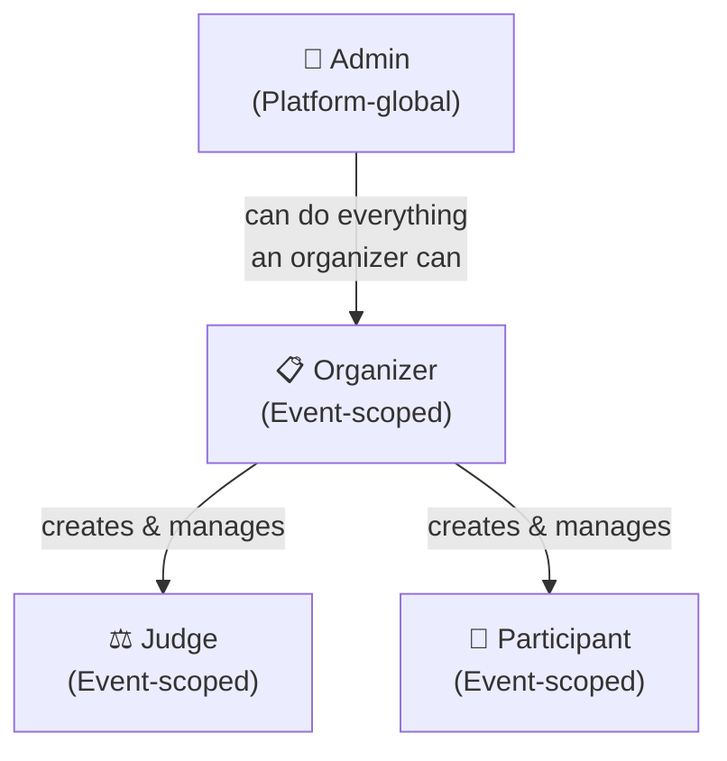

# Actors & Roles

> Hard Rule: Roles are **event-scoped**. A user can be organizer of Event A and judge of Event B.
> The only platform-global role is `admin`.

---

## Role Hierarchy

---

## 1. Participant

The person building and submitting a hackathon project.

### Can
- Register an account on the platform
- **Register for a hackathon event** (opt-in to an event)
- **Un-register from a hackathon event** (before submission deadline only)
- Create a team for an event (becomes owner)
- Join a team via invite link shared by owner
- Leave a team (before submission is finalized)
- Create a project submission (status = draft)
- Edit their submission before the deadline
- Submit their final project before the deadline
- View the public gallery
- Cast community votes on other teams' projects (T3)
- View published results and leaderboard
- Download their participation certificate (T4)

### Cannot
- See judge scores or rubric evaluations (ever, until results published)
- See other teams' draft submissions
- Assign or manage judges
- Create or configure events
- See vote counts before the voting window closes
- Un-register after they have a submitted (non-draft) submission
- Be on more than one team per event

---

## 2. Judge

A person assigned to evaluate submitted projects.

### Can
- Accept a judge invitation and create/link their account
- View the list of submissions assigned to them
- Score each assigned submission using the event rubric
- Add per-criterion comments alongside scores
- Save partial scores and return later (before deadline)
- View their own progress dashboard (N of M assignments completed)
- Declare a conflict of interest on an assignment (triggers recusal)
- View final published results (same as public)

### Cannot
- See other judges' scores for the same project **while the judging window is open**
- Be assigned to a submission from their own team (enforced, not just prevented in UI)
- Vote in community voting (T3 — role conflict)
- Access organizer configuration panels
- See normalized scores until results are published
- Update scores after the judging deadline
- See how many judges are assigned to a given project

---

## 3. Organizer

The person running a specific hackathon event.

### Can
- Create and configure events (dates, tracks, prizes, rubric)
- Edit event settings (before deadline windows pass)
- Invite judges by email
- Manually assign judges to submissions
- Trigger algorithmic batch judge assignment
- Monitor judge progress in real-time dashboard
- View all raw scores across all judges
- Trigger score normalization (after judging deadline)
- Preview normalized results before publishing
- Publish results to the public gallery
- Export data as CSV at any stage (teams, submissions, scores, votes)
- Enable and configure community voting
- Disqualify submissions
- Generate and issue certificates (T4)
- View the event's audit log

### Cannot
- Score projects as a judge (unless separately invited as a judge for the same event)
- Edit submissions after their deadline
- Delete audit log entries
- Change scores after they are submitted by a judge (read-only to organizer)

---

## 4. Admin

Platform-level super user. Does not manage events directly — manages the platform.

### Can
- Everything an organizer can do, across **all events**
- Create organizer accounts
- Manage platform-wide configuration
- View the platform-wide audit log
- Impersonate users for support purposes (always logged)
- Delete events (with confirmation and safeguards)
- Suspend or deactivate user accounts

### Cannot
- Bypass audit logging (the middleware enforces this unconditionally)
- Alter historical scores silently (any change is logged as an admin override)

---

## Role Assignment Rules

| Scenario | Rule |
|----------|------|
| User creates an account | No role — must register for an event or be invited |
| User registers for event | Gets `participant` role for that event |
| Organizer invites someone as judge | Gets `judge` role for that event |
| Admin creates organizer | Gets `organizer` role (platform-scoped for organizers) |
| Judge is also a participant in another event | Separate role assignments — no conflict |
| Organizer participates in a different event | Allowed — separate event, separate role |
