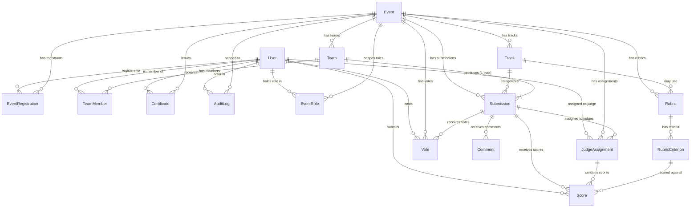

# DATA MODEL
# Dogfood Hackathon Platform

> **Target DB**: PostgreSQL 16
> **Consistency anchor**: MASTER-CONTEXT.md (14 entities, 19 invariants)
> **File storage**: MinIO — only URLs are stored in PostgreSQL, never binary data

---

## 1. Logical Model (DB-Agnostic ERD)



---

## 2. Entity Relationship Summary

| Relationship | Cardinality | Key Constraint |
|-------------|-------------|----------------|
| User → Event | M:N via EventRegistration | (user_id, event_id) unique |
| User → Team | M:N via TeamMember | (user_id, event_id) unique — ONE team per user per event (I1) |
| Team → Submission | 1:1 per event | (team_id, event_id) unique (I2) |
| Event → Rubric | 1:N (one per track or one global) | |
| Rubric → RubricCriterion | 1:N | SUM(weight) = 1.0 (I14) |
| JudgeAssignment → Score | 1:N (one per criterion) | (assignment_id, criterion_id) unique |
| User → Vote | M:N via Vote | (voter_id, submission_id) unique (I5) |
| User → EventRole | M:N | (user_id, event_id, role) unique |

---

## 3. Physical Schema — PostgreSQL 16

> Conventions:
> - All PKs: `UUID` generated via `gen_random_uuid()`
> - All timestamps: `TIMESTAMPTZ` (UTC stored, timezone-aware)
> - All text IDs stored as `TEXT` not `VARCHAR(n)` — PostgreSQL optimizes identically
> - Soft deletes via `is_active` / `deleted_at` — no hard DELETEs on core entities
> - All tables have `created_at TIMESTAMPTZ NOT NULL DEFAULT now()`
> - `updated_at` maintained by trigger on mutable tables

---

### 3.1 `users`

```sql
CREATE TABLE users (
    id              UUID        PRIMARY KEY DEFAULT gen_random_uuid(),
    email           TEXT        NOT NULL,
    password_hash   TEXT        NOT NULL,               -- bcrypt, cost ≥ 12
    display_name    TEXT        NOT NULL,
    avatar_url      TEXT,                               -- MinIO presigned URL
    bio             TEXT,
    is_verified     BOOLEAN     NOT NULL DEFAULT false,
    is_active       BOOLEAN     NOT NULL DEFAULT true,
    is_admin        BOOLEAN     NOT NULL DEFAULT false,
    verified_at     TIMESTAMPTZ,
    last_login_at   TIMESTAMPTZ,
    created_at      TIMESTAMPTZ NOT NULL DEFAULT now(),
    updated_at      TIMESTAMPTZ NOT NULL DEFAULT now()
);

-- Constraints
ALTER TABLE users ADD CONSTRAINT users_email_unique UNIQUE (email);
ALTER TABLE users ADD CONSTRAINT users_email_format
    CHECK (email ~* '^[^@]+@[^@]+\.[^@]+$');

-- Indexes
CREATE INDEX idx_users_email     ON users (email);
CREATE INDEX idx_users_is_active ON users (is_active) WHERE is_active = true;
```

---

### 3.2 `refresh_tokens`

```sql
CREATE TABLE refresh_tokens (
    id          UUID        PRIMARY KEY DEFAULT gen_random_uuid(),
    user_id     UUID        NOT NULL REFERENCES users(id) ON DELETE CASCADE,
    token_hash  TEXT        NOT NULL,                   -- SHA-256 of raw token
    expires_at  TIMESTAMPTZ NOT NULL,
    revoked_at  TIMESTAMPTZ,
    issued_at   TIMESTAMPTZ NOT NULL DEFAULT now(),
    ip_hash     TEXT                                    -- SHA-256 of client IP
);

CREATE UNIQUE INDEX idx_refresh_tokens_hash   ON refresh_tokens (token_hash);
CREATE INDEX        idx_refresh_tokens_user   ON refresh_tokens (user_id);
CREATE INDEX        idx_refresh_tokens_expiry ON refresh_tokens (expires_at)
    WHERE revoked_at IS NULL;
```

---

### 3.2.1 `email_verification_tokens` (Upcoming for A-006)

```sql
CREATE TABLE email_verification_tokens (
    id          UUID        PRIMARY KEY DEFAULT gen_random_uuid(),
    user_id     UUID        NOT NULL REFERENCES users(id) ON DELETE CASCADE,
    token_hash  TEXT        NOT NULL,
    expires_at  TIMESTAMPTZ NOT NULL,
    issued_at   TIMESTAMPTZ NOT NULL DEFAULT now(),
    is_used     BOOLEAN     NOT NULL DEFAULT false
);

CREATE UNIQUE INDEX idx_email_verification_tokens_hash ON email_verification_tokens (token_hash);
CREATE INDEX        idx_email_verification_tokens_user ON email_verification_tokens (user_id);
```

---

### 3.2.2 `webauthn_credentials` (Upcoming for A-007)

```sql
CREATE TABLE webauthn_credentials (
    id               UUID        PRIMARY KEY DEFAULT gen_random_uuid(),
    user_id          UUID        NOT NULL REFERENCES users(id) ON DELETE CASCADE,
    credential_id    BYTEA       NOT NULL UNIQUE,
    public_key       BYTEA       NOT NULL,
    attestation_type TEXT        NOT NULL,
    aaguid           BYTEA       NOT NULL,
    sign_count       BIGINT      NOT NULL DEFAULT 0,
    created_at       TIMESTAMPTZ NOT NULL DEFAULT now(),
    last_used_at     TIMESTAMPTZ
);

CREATE INDEX idx_webauthn_credentials_user ON webauthn_credentials (user_id);
```

---

### 3.3 `events`

```sql
CREATE TYPE event_status AS ENUM (
    'draft',
    'registration_open',
    'submissions_open',
    'judging',
    'voting',
    'results_published',
    'archived'
);

CREATE TABLE events (
    id                      UUID         PRIMARY KEY DEFAULT gen_random_uuid(),
    slug                    TEXT         NOT NULL,    -- e.g. 'dogfood-2026'
    title                   TEXT         NOT NULL,
    tagline                 TEXT,
    description             TEXT,
    banner_url              TEXT,                     -- MinIO URL
    website_url             TEXT,
    status                  event_status NOT NULL DEFAULT 'draft',

    -- Time windows (all TIMESTAMPTZ, all required before publishing)
    registration_opens_at   TIMESTAMPTZ,
    registration_closes_at  TIMESTAMPTZ,
    submission_opens_at     TIMESTAMPTZ,
    submission_deadline_at  TIMESTAMPTZ  NOT NULL,
    judging_opens_at        TIMESTAMPTZ,
    judging_deadline_at     TIMESTAMPTZ  NOT NULL,
    voting_opens_at         TIMESTAMPTZ,             -- NULL if no voting
    voting_closes_at        TIMESTAMPTZ,             -- NULL if no voting

    -- Configuration
    max_team_size           SMALLINT     NOT NULL DEFAULT 4
                                CHECK (max_team_size BETWEEN 1 AND 10),
    min_team_size           SMALLINT     NOT NULL DEFAULT 1
                                CHECK (min_team_size >= 1),
    judges_per_submission   SMALLINT     NOT NULL DEFAULT 3
                                CHECK (judges_per_submission BETWEEN 1 AND 10),
    voting_weight           DECIMAL(4,3) NOT NULL DEFAULT 0.000
                                CHECK (voting_weight BETWEEN 0 AND 1),

    -- Normalization tracking
    normalization_status    TEXT         NOT NULL DEFAULT 'awaiting_judging'
                                CHECK (normalization_status IN (
                                    'awaiting_judging','ready_to_normalize',
                                    'normalizing','normalized','previewing'
                                )),
    normalized_at           TIMESTAMPTZ,

    -- Meta
    created_by              UUID         NOT NULL REFERENCES users(id),
    is_public               BOOLEAN      NOT NULL DEFAULT true,
    created_at              TIMESTAMPTZ  NOT NULL DEFAULT now(),
    updated_at              TIMESTAMPTZ  NOT NULL DEFAULT now(),

    -- Date ordering guards
    CONSTRAINT events_date_order CHECK (
        submission_deadline_at > submission_opens_at AND
        judging_deadline_at    > judging_opens_at
    ),
    CONSTRAINT events_team_size_order CHECK (
        min_team_size <= max_team_size
    )
);

CREATE UNIQUE INDEX idx_events_slug   ON events (slug);
CREATE INDEX        idx_events_status ON events (status);
CREATE INDEX        idx_events_public ON events (is_public, status);
```

---

### 3.4 `event_roles`

```sql
-- Event-scoped roles: participant, judge, organizer
-- Admin is stored as users.is_admin (platform-global)
CREATE TYPE event_role_type AS ENUM ('participant', 'judge', 'organizer');

CREATE TABLE event_roles (
    id          UUID            PRIMARY KEY DEFAULT gen_random_uuid(),
    event_id    UUID            NOT NULL REFERENCES events(id) ON DELETE CASCADE,
    user_id     UUID            NOT NULL REFERENCES users(id) ON DELETE CASCADE,
    role        event_role_type NOT NULL,
    granted_at  TIMESTAMPTZ     NOT NULL DEFAULT now(),
    granted_by  UUID            REFERENCES users(id)
);

CREATE UNIQUE INDEX idx_event_roles_unique
    ON event_roles (event_id, user_id, role);
CREATE INDEX idx_event_roles_user
    ON event_roles (user_id);
CREATE INDEX idx_event_roles_event_role
    ON event_roles (event_id, role);
```

---

### 3.5 `event_registrations`

```sql
CREATE TABLE event_registrations (
    id               UUID        PRIMARY KEY DEFAULT gen_random_uuid(),
    event_id         UUID        NOT NULL REFERENCES events(id) ON DELETE CASCADE,
    user_id          UUID        NOT NULL REFERENCES users(id) ON DELETE CASCADE,
    registered_at    TIMESTAMPTZ NOT NULL DEFAULT now(),
    unregistered_at  TIMESTAMPTZ,                    -- NULL = currently registered
    is_active        BOOLEAN     NOT NULL DEFAULT true,
    created_at       TIMESTAMPTZ NOT NULL DEFAULT now()
);

-- I1 analog: one active registration per (event, user)
CREATE UNIQUE INDEX idx_event_registrations_active
    ON event_registrations (event_id, user_id)
    WHERE is_active = true;

CREATE INDEX idx_event_registrations_event ON event_registrations (event_id);
CREATE INDEX idx_event_registrations_user  ON event_registrations (user_id);
```

---

### 3.6 `tracks`

```sql
CREATE TABLE tracks (
    id          UUID        PRIMARY KEY DEFAULT gen_random_uuid(),
    event_id    UUID        NOT NULL REFERENCES events(id) ON DELETE CASCADE,
    name        TEXT        NOT NULL,
    description TEXT,
    prizes      JSONB       NOT NULL DEFAULT '[]',
    -- prizes format: [{"place": 1, "title": "1st Place", "value": "$500", "description": "..."}]
    sort_order  SMALLINT    NOT NULL DEFAULT 0,
    is_active   BOOLEAN     NOT NULL DEFAULT true,
    created_at  TIMESTAMPTZ NOT NULL DEFAULT now(),
    updated_at  TIMESTAMPTZ NOT NULL DEFAULT now()
);

CREATE INDEX idx_tracks_event ON tracks (event_id) WHERE is_active = true;
CREATE UNIQUE INDEX idx_tracks_event_name
    ON tracks (event_id, name) WHERE is_active = true;
```

---

### 3.7 `teams`

```sql
CREATE TABLE teams (
    id           UUID        PRIMARY KEY DEFAULT gen_random_uuid(),
    event_id     UUID        NOT NULL REFERENCES events(id) ON DELETE CASCADE,
    name         TEXT        NOT NULL,
    invite_code  TEXT        NOT NULL,       -- random 8-char token, uppercased
    created_by   UUID        NOT NULL REFERENCES users(id),
    is_locked    BOOLEAN     NOT NULL DEFAULT false,
    locked_at    TIMESTAMPTZ,
    created_at   TIMESTAMPTZ NOT NULL DEFAULT now(),
    updated_at   TIMESTAMPTZ NOT NULL DEFAULT now()
);

CREATE UNIQUE INDEX idx_teams_invite_code ON teams (invite_code);
CREATE INDEX        idx_teams_event       ON teams (event_id);
CREATE UNIQUE INDEX idx_teams_event_name
    ON teams (event_id, name);
```

---

### 3.8 `team_members`

```sql
CREATE TYPE team_member_role AS ENUM ('owner', 'member');

CREATE TABLE team_members (
    id          UUID             PRIMARY KEY DEFAULT gen_random_uuid(),
    team_id     UUID             NOT NULL REFERENCES teams(id) ON DELETE CASCADE,
    user_id     UUID             NOT NULL REFERENCES users(id) ON DELETE CASCADE,
    event_id    UUID             NOT NULL REFERENCES events(id) ON DELETE CASCADE,
    role        team_member_role NOT NULL DEFAULT 'member',
    joined_at   TIMESTAMPTZ      NOT NULL DEFAULT now()
);

-- I1: One team per user per event (enforced at DB level)
CREATE UNIQUE INDEX idx_team_members_user_event
    ON team_members (user_id, event_id);
CREATE INDEX idx_team_members_team
    ON team_members (team_id);
```

---

### 3.9 `submissions`

```sql
CREATE TYPE submission_status AS ENUM ('draft', 'submitted', 'disqualified');

CREATE TABLE submissions (
    id                  UUID              PRIMARY KEY DEFAULT gen_random_uuid(),
    team_id             UUID              NOT NULL REFERENCES teams(id),
    event_id            UUID              NOT NULL REFERENCES events(id) ON DELETE CASCADE,
    track_id            UUID              REFERENCES tracks(id),

    -- Content
    title               TEXT              NOT NULL,
    tagline             TEXT,
    description         TEXT,
    demo_url            TEXT,
    repo_url            TEXT,
    video_url           TEXT,
    cover_image_url     TEXT,             -- MinIO presigned URL or public object URL
    additional_links    JSONB             NOT NULL DEFAULT '[]',
    -- additional_links format: [{"label": "Slides", "url": "https://..."}]
    tags                TEXT[]            NOT NULL DEFAULT '{}',

    -- Status
    status              submission_status NOT NULL DEFAULT 'draft',
    submitted_at        TIMESTAMPTZ,
    disqualified_at     TIMESTAMPTZ,
    disqualification_reason TEXT,

    -- Results (populated after normalization)
    final_score         DECIMAL(10, 6),   -- normalized final score
    raw_weighted_total  DECIMAL(10, 6),   -- pre-normalization weighted avg
    rank                INTEGER,          -- rank within track after results publish
    gallery_order       INTEGER,          -- randomized order for gallery display

    created_at          TIMESTAMPTZ       NOT NULL DEFAULT now(),
    updated_at          TIMESTAMPTZ       NOT NULL DEFAULT now()
);

-- I2: One submission per team per event
CREATE UNIQUE INDEX idx_submissions_team_event
    ON submissions (team_id, event_id);
CREATE INDEX idx_submissions_event_status
    ON submissions (event_id, status);
CREATE INDEX idx_submissions_event_track
    ON submissions (event_id, track_id);
CREATE INDEX idx_submissions_gallery
    ON submissions (event_id, gallery_order)
    WHERE status = 'submitted';

-- Full-text search on title + tagline + description
ALTER TABLE submissions ADD COLUMN search_vector TSVECTOR
    GENERATED ALWAYS AS (
        to_tsvector('english',
            coalesce(title, '') || ' ' ||
            coalesce(tagline, '') || ' ' ||
            coalesce(description, '')
        )
    ) STORED;
CREATE INDEX idx_submissions_search ON submissions USING GIN (search_vector);
```

---

### 3.10 `rubrics`

```sql
CREATE TABLE rubrics (
    id          UUID        PRIMARY KEY DEFAULT gen_random_uuid(),
    event_id    UUID        NOT NULL REFERENCES events(id) ON DELETE CASCADE,
    track_id    UUID        REFERENCES tracks(id),  -- NULL = global rubric for event
    name        TEXT        NOT NULL,
    description TEXT,
    is_active   BOOLEAN     NOT NULL DEFAULT true,
    is_complete BOOLEAN     NOT NULL DEFAULT false,  -- true when weights sum to 1.0
    created_at  TIMESTAMPTZ NOT NULL DEFAULT now(),
    updated_at  TIMESTAMPTZ NOT NULL DEFAULT now()
);

CREATE INDEX idx_rubrics_event ON rubrics (event_id) WHERE is_active = true;
```

---

### 3.11 `rubric_criteria`

```sql
CREATE TABLE rubric_criteria (
    id          UUID         PRIMARY KEY DEFAULT gen_random_uuid(),
    rubric_id   UUID         NOT NULL REFERENCES rubrics(id) ON DELETE CASCADE,
    name        TEXT         NOT NULL,
    description TEXT,
    max_score   DECIMAL(5,2) NOT NULL CHECK (max_score > 0),
    weight      DECIMAL(5,4) NOT NULL CHECK (weight > 0 AND weight <= 1),
    -- I14: SUM(weight) per rubric = 1.0 enforced at service layer + trigger
    sort_order  SMALLINT     NOT NULL DEFAULT 0,
    created_at  TIMESTAMPTZ  NOT NULL DEFAULT now(),
    updated_at  TIMESTAMPTZ  NOT NULL DEFAULT now()
);

CREATE INDEX idx_rubric_criteria_rubric
    ON rubric_criteria (rubric_id, sort_order);

-- Trigger to update rubrics.is_complete when criteria weights change
-- Implemented as: UPDATE rubrics SET is_complete = (
--   ABS(SUM(weight) - 1.0) < 0.0001
-- ) WHERE id = rubric_id
```

---

### 3.12 `judge_assignments`

```sql
CREATE TYPE assignment_status AS ENUM (
    'pending',
    'in_progress',
    'completed',
    'recused'
);

CREATE TABLE judge_assignments (
    id           UUID              PRIMARY KEY DEFAULT gen_random_uuid(),
    event_id     UUID              NOT NULL REFERENCES events(id) ON DELETE CASCADE,
    submission_id UUID             NOT NULL REFERENCES submissions(id) ON DELETE CASCADE,
    judge_id     UUID              NOT NULL REFERENCES users(id),
    assigned_at  TIMESTAMPTZ       NOT NULL DEFAULT now(),
    assigned_by  UUID              NOT NULL REFERENCES users(id),
    status       assignment_status NOT NULL DEFAULT 'pending',
    completed_at TIMESTAMPTZ,
    recused_at   TIMESTAMPTZ,
    recusal_reason TEXT
);

-- One active assignment per (judge, submission)
CREATE UNIQUE INDEX idx_assignments_judge_submission
    ON judge_assignments (judge_id, submission_id)
    WHERE status != 'recused';
CREATE INDEX idx_assignments_event
    ON judge_assignments (event_id);
CREATE INDEX idx_assignments_judge
    ON judge_assignments (judge_id, status);
CREATE INDEX idx_assignments_submission
    ON judge_assignments (submission_id, status);
```

---

### 3.13 `scores`

```sql
CREATE TABLE scores (
    id                UUID         PRIMARY KEY DEFAULT gen_random_uuid(),
    assignment_id     UUID         NOT NULL REFERENCES judge_assignments(id) ON DELETE CASCADE,
    submission_id     UUID         NOT NULL REFERENCES submissions(id) ON DELETE CASCADE,
    judge_id          UUID         NOT NULL REFERENCES users(id),
    criterion_id      UUID         NOT NULL REFERENCES rubric_criteria(id),

    -- Raw score — immutable after judging deadline (I6), never overwritten
    raw_score         DECIMAL(5,2) NOT NULL,
    -- CHECK: 0 ≤ raw_score ≤ criterion.max_score enforced at service layer

    -- Normalized score — populated by normalization job, null before normalization
    normalized_score  DECIMAL(10,6),

    comment           TEXT,
    scored_at         TIMESTAMPTZ  NOT NULL DEFAULT now(),
    updated_at        TIMESTAMPTZ  NOT NULL DEFAULT now()
);

-- I9: One score per (assignment, criterion)
CREATE UNIQUE INDEX idx_scores_assignment_criterion
    ON scores (assignment_id, criterion_id);
CREATE INDEX idx_scores_submission
    ON scores (submission_id);
CREATE INDEX idx_scores_judge
    ON scores (judge_id);
-- Normalization query: all scores by a judge in an event
CREATE INDEX idx_scores_judge_assignment
    ON scores (judge_id, assignment_id);
```

---

### 3.14 `votes`

```sql
CREATE TABLE votes (
    id            UUID        PRIMARY KEY DEFAULT gen_random_uuid(),
    submission_id UUID        NOT NULL REFERENCES submissions(id) ON DELETE CASCADE,
    voter_id      UUID        NOT NULL REFERENCES users(id),
    event_id      UUID        NOT NULL REFERENCES events(id) ON DELETE CASCADE,
    voted_at      TIMESTAMPTZ NOT NULL DEFAULT now(),
    ip_hash       TEXT        NOT NULL   -- SHA-256(raw_ip), never store raw IP
);

-- I5: One vote per user per submission
CREATE UNIQUE INDEX idx_votes_voter_submission ON votes (voter_id, submission_id);
CREATE INDEX        idx_votes_submission        ON votes (submission_id);
CREATE INDEX        idx_votes_event             ON votes (event_id);
-- Sybil detection: cluster by ip_hash
CREATE INDEX        idx_votes_ip_hash           ON votes (ip_hash, event_id);
```

---

### 3.15 `comments` (T3)

```sql
CREATE TABLE comments (
    id            UUID        PRIMARY KEY DEFAULT gen_random_uuid(),
    submission_id UUID        NOT NULL REFERENCES submissions(id) ON DELETE CASCADE,
    event_id      UUID        NOT NULL REFERENCES events(id) ON DELETE CASCADE,
    author_id     UUID        NOT NULL REFERENCES users(id),
    body          TEXT        NOT NULL CHECK (length(body) BETWEEN 1 AND 2000),
    is_deleted    BOOLEAN     NOT NULL DEFAULT false,
    deleted_at    TIMESTAMPTZ,
    created_at    TIMESTAMPTZ NOT NULL DEFAULT now(),
    updated_at    TIMESTAMPTZ NOT NULL DEFAULT now()
);

CREATE INDEX idx_comments_submission
    ON comments (submission_id, created_at)
    WHERE is_deleted = false;
```

---

### 3.16 `certificates` (T4)

```sql
CREATE TYPE certificate_type AS ENUM ('participation', 'winner', 'judge');

CREATE TABLE certificates (
    id                UUID             PRIMARY KEY DEFAULT gen_random_uuid(),
    user_id           UUID             NOT NULL REFERENCES users(id),
    event_id          UUID             NOT NULL REFERENCES events(id),
    type              certificate_type NOT NULL,
    rank              INTEGER,                    -- NULL for participation/judge certs
    verification_hash TEXT             NOT NULL,  -- HMAC-SHA256, tamper-proof
    issued_at         TIMESTAMPTZ      NOT NULL DEFAULT now(),
    revoked_at        TIMESTAMPTZ                 -- organizer can revoke
);

CREATE UNIQUE INDEX idx_certificates_user_event_type
    ON certificates (user_id, event_id, type);
CREATE UNIQUE INDEX idx_certificates_hash
    ON certificates (verification_hash);
CREATE INDEX idx_certificates_event
    ON certificates (event_id);
```

---

### 3.17 `audit_log`

```sql
-- Action enum covers all state-changing operations
CREATE TYPE audit_action AS ENUM (
    -- Auth
    'user.registered', 'user.verified', 'user.login', 'user.logout',
    'user.deactivated', 'admin.impersonated',
    -- Event
    'event.created', 'event.updated', 'event.status_changed', 'event.deleted',
    -- Registration
    'event.registered', 'event.unregistered',
    -- Team
    'team.created', 'team.joined', 'team.left', 'team.locked',
    -- Submission
    'submission.created', 'submission.edited', 'submission.submitted',
    'submission.disqualified', 'submission.reinstated',
    -- Judge
    'judge.invited', 'judge.assignment_created', 'judge.assignment_auto',
    'judge.scored', 'judge.completed', 'judge.recused',
    -- Normalization
    'normalization.triggered', 'normalization.completed',
    -- Results
    'results.published', 'results.previewed',
    -- Voting
    'vote.cast', 'vote.flagged',
    -- Certificates
    'certificate.issued', 'certificate.revoked'
);

CREATE TABLE audit_log (
    id          UUID         PRIMARY KEY DEFAULT gen_random_uuid(),
    event_id    UUID         REFERENCES events(id),   -- NULL for platform-level actions
    actor_id    UUID         REFERENCES users(id),    -- NULL for system-triggered actions
    action      audit_action NOT NULL,
    target_type TEXT,                                 -- e.g. 'submission', 'team'
    target_id   UUID,                                 -- ID of the affected entity
    metadata    JSONB        NOT NULL DEFAULT '{}',   -- action-specific context
    ip_hash     TEXT,                                 -- SHA-256(client IP)
    created_at  TIMESTAMPTZ  NOT NULL DEFAULT now()
    -- NO updated_at — this table is append-only (I7)
);

-- I7: Remove UPDATE and DELETE privileges from the app user
-- REVOKE UPDATE, DELETE ON audit_log FROM app_user;
-- Enforced at DB privilege level, not just application code.

CREATE INDEX idx_audit_log_event   ON audit_log (event_id, created_at DESC);
CREATE INDEX idx_audit_log_actor   ON audit_log (actor_id, created_at DESC);
CREATE INDEX idx_audit_log_action  ON audit_log (action);
CREATE INDEX idx_audit_log_target  ON audit_log (target_type, target_id);
CREATE INDEX idx_audit_log_created ON audit_log (created_at DESC);
```

---

### 3.18 `uploads` (MinIO metadata tracker)

```sql
-- Tracks every file uploaded to MinIO so orphans can be cleaned up
-- and access control can be enforced server-side
CREATE TABLE uploads (
    id           UUID        PRIMARY KEY DEFAULT gen_random_uuid(),
    bucket       TEXT        NOT NULL,   -- 'uploads' | 'certificates'
    object_key   TEXT        NOT NULL,   -- MinIO object key
    filename     TEXT        NOT NULL,   -- original filename from user
    mime_type    TEXT        NOT NULL,
    size_bytes   BIGINT      NOT NULL,
    uploader_id  UUID        NOT NULL REFERENCES users(id),
    entity_type  TEXT,                   -- 'submission', 'event', 'user'
    entity_id    UUID,                   -- which entity this file belongs to
    is_public    BOOLEAN     NOT NULL DEFAULT false,
    uploaded_at  TIMESTAMPTZ NOT NULL DEFAULT now(),
    deleted_at   TIMESTAMPTZ             -- soft delete before MinIO cleanup
);

CREATE UNIQUE INDEX idx_uploads_object_key ON uploads (bucket, object_key);
CREATE INDEX        idx_uploads_entity     ON uploads (entity_type, entity_id);
CREATE INDEX        idx_uploads_uploader   ON uploads (uploader_id);
```

---

### 3.19 `judge_invites`

```sql
-- Tracks pending judge invitations before they accept
CREATE TABLE judge_invites (
    id          UUID        PRIMARY KEY DEFAULT gen_random_uuid(),
    event_id    UUID        NOT NULL REFERENCES events(id) ON DELETE CASCADE,
    email       TEXT        NOT NULL,
    token_hash  TEXT        NOT NULL,    -- SHA-256 of the invite token
    invited_by  UUID        NOT NULL REFERENCES users(id),
    invited_at  TIMESTAMPTZ NOT NULL DEFAULT now(),
    accepted_at TIMESTAMPTZ,
    expires_at  TIMESTAMPTZ NOT NULL,
    is_used     BOOLEAN     NOT NULL DEFAULT false
);

CREATE UNIQUE INDEX idx_judge_invites_token ON judge_invites (token_hash);
CREATE INDEX        idx_judge_invites_event ON judge_invites (event_id);
CREATE INDEX        idx_judge_invites_email ON judge_invites (event_id, email);
```

---

## 4. Database-Level Invariant Enforcement

| Invariant | PostgreSQL Enforcement |
|-----------|----------------------|
| I1: One team per user per event | `UNIQUE (user_id, event_id)` on `team_members` |
| I2: One submission per team per event | `UNIQUE (team_id, event_id)` on `submissions` |
| I5: One vote per user per submission | `UNIQUE (voter_id, submission_id)` on `votes` |
| I7: Audit log append-only | `REVOKE UPDATE, DELETE ON audit_log FROM app_user` |
| I14: Rubric weights sum to 1.0 | Trigger on `rubric_criteria` updates `rubrics.is_complete` |
| Date ordering | `CHECK` constraints on `events` |
| Score range (0 to max) | Service layer (max comes from joined criterion) |
| IP never stored raw | Application layer: always SHA-256 before INSERT |

---

## 5. Index Strategy Summary

| Query Pattern | Index |
|--------------|-------|
| Public event list | `idx_events_status`, `idx_events_public` |
| Public gallery (submitted, by event) | `idx_submissions_event_status` |
| Gallery randomized order | `idx_submissions_gallery` (gallery_order column) |
| Gallery full-text search | `idx_submissions_search` (GIN tsvector) |
| Judge's assignment queue | `idx_assignments_judge` |
| Normalization: all scores by a judge | `idx_scores_judge_assignment` |
| Sybil detection: votes by IP | `idx_votes_ip_hash` |
| Audit log by event (organizer) | `idx_audit_log_event` |
| Audit log by actor (admin) | `idx_audit_log_actor` |
| Certificate verification (public) | `idx_certificates_hash` |

---

## 6. Normalization Query (Reference Implementation)

The Z-score normalization from the PRD, expressed as PostgreSQL:

```sql
-- Step 1: Compute per-judge stats
WITH judge_stats AS (
    SELECT
        s.judge_id,
        AVG(s.raw_score)    AS mu,
        STDDEV(s.raw_score) AS sigma
    FROM scores s
    JOIN judge_assignments ja ON ja.id = s.assignment_id
    WHERE ja.event_id = $1
      AND ja.status   = 'completed'
    GROUP BY s.judge_id
),

-- Step 2: Compute normalized scores
normalized AS (
    SELECT
        s.id,
        s.raw_score,
        CASE
            WHEN js.sigma = 0 OR js.sigma IS NULL
            THEN 0.0
            ELSE (s.raw_score - js.mu) / js.sigma
        END AS normalized_score
    FROM scores s
    JOIN judge_assignments ja ON ja.id = s.assignment_id
    JOIN judge_stats js        ON js.judge_id = s.judge_id
    WHERE ja.event_id = $1 AND ja.status = 'completed'
),

-- Step 3: Weighted normalized total per (judge × submission)
weighted AS (
    SELECT
        s.judge_id,
        s.submission_id,
        SUM(n.normalized_score * rc.weight) AS weighted_norm
    FROM scores s
    JOIN normalized n        ON n.id = s.id
    JOIN rubric_criteria rc  ON rc.id = s.criterion_id
    JOIN judge_assignments ja ON ja.id = s.assignment_id
    WHERE ja.status = 'completed'
    GROUP BY s.judge_id, s.submission_id
),

-- Step 4: Final score per submission
final AS (
    SELECT
        submission_id,
        AVG(weighted_norm) AS final_score,
        COUNT(*)           AS judge_count
    FROM weighted
    GROUP BY submission_id
)

-- Step 5: Update submissions table
UPDATE submissions s
SET
    normalized_score   = f.final_score,   -- reusing final_score column
    final_score        = f.final_score,
    rank               = RANK() OVER (
                            PARTITION BY s.track_id
                            ORDER BY f.final_score DESC NULLS LAST
                         )
FROM final f
WHERE s.id = f.submission_id
  AND s.event_id = $1;
```

---

## 7. MinIO Bucket Structure

```
minio/
├── uploads/                       -- user-generated content
│   ├── avatars/{user_id}/{uuid}.{ext}
│   ├── covers/{submission_id}/{uuid}.{ext}
│   └── banners/{event_id}/{uuid}.{ext}
└── certificates/                  -- generated server-side
    └── {event_id}/{user_id}/{type}.pdf
```

**Access policy:**
- `uploads/avatars/**` — public read
- `uploads/covers/**` — public read (after submission)
- `uploads/banners/**` — public read
- `certificates/**` — private, served via presigned URL with 1hr expiry

---

## 8. Migration Strategy

```
migrations/
├── 001_create_users.sql
├── 002_create_refresh_tokens.sql
├── 003_create_events.sql
├── 004_create_event_roles.sql
├── 005_create_event_registrations.sql
├── 006_create_tracks.sql
├── 007_create_teams.sql
├── 008_create_team_members.sql
├── 009_create_submissions.sql
├── 010_create_rubrics.sql
├── 011_create_rubric_criteria.sql
├── 012_create_judge_invites.sql
├── 013_create_judge_assignments.sql
├── 014_create_scores.sql
├── 015_create_votes.sql
├── 016_create_comments.sql
├── 017_create_certificates.sql
├── 018_create_audit_log.sql
├── 019_create_uploads.sql
├── 020_create_indexes.sql
├── 021_create_triggers.sql       -- updated_at triggers, rubric weight trigger
└── 022_revoke_privileges.sql     -- REVOKE UPDATE/DELETE on audit_log
```

- Migrations run automatically on app startup via migration runner
- Each migration is a single transaction — rolls back fully on failure
- `schema_migrations` table tracks applied migrations
- Down migrations provided for all tables

---

## 9. Seed Data Shape

```
Seed creates (idempotent, safe to re-run):
  1 admin user                (admin@example.com / Admin1234!)
  2 organizer users           (organizer1@..., organizer2@...)
  10 judge users              (judge1@... through judge10@...)
  30 participant users        (participant1@... through participant30@...)

  1 event ("Dogfood 2026", slug: dogfood-2026, status: submissions_open)
  3 tracks                    (Open, AI, Sustainability)
  1 global rubric with 4 criteria:
    - Innovation      (max: 10, weight: 0.30)
    - Technical Depth (max: 10, weight: 0.30)
    - Impact          (max: 10, weight: 0.25)
    - Presentation    (max: 10, weight: 0.15)
    -- weights sum: 1.00 ✓

  20 teams (2 members each)
  20 submissions (status: submitted, spread across 3 tracks)
  60 judge assignments (3 per submission, conflict-free)
  240 scores (4 criteria × 60 assignments — complete scores)
  -- Ready for normalization to be triggered immediately
```

---

*Next document: ARCHITECTURE.md — service topology, request lifecycle, tech stack rationale*
*Written after reading MASTER-CONTEXT.md*
