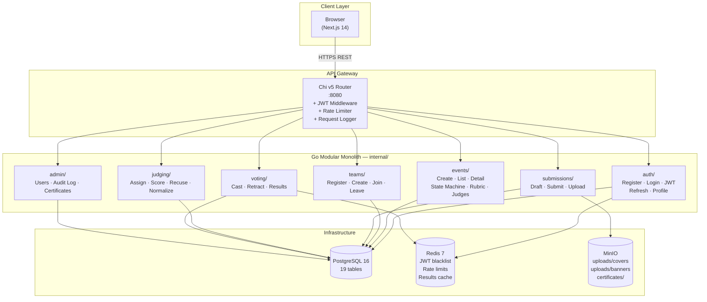
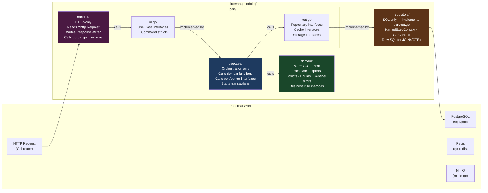
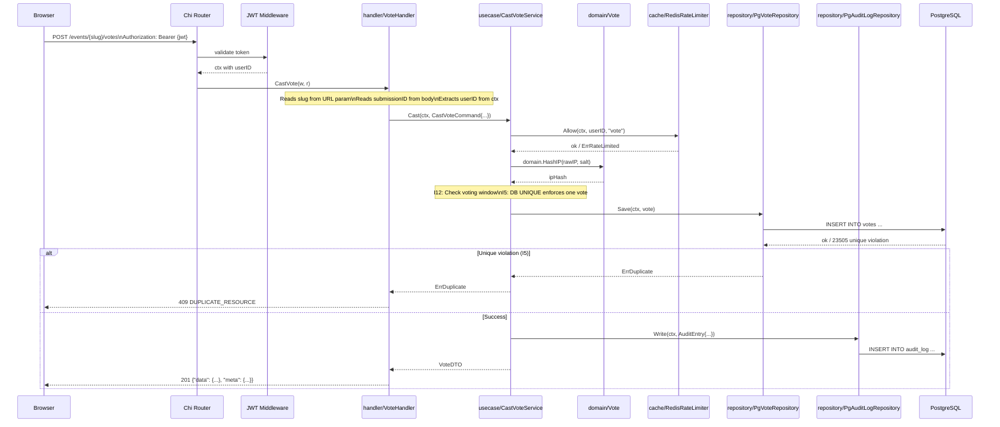
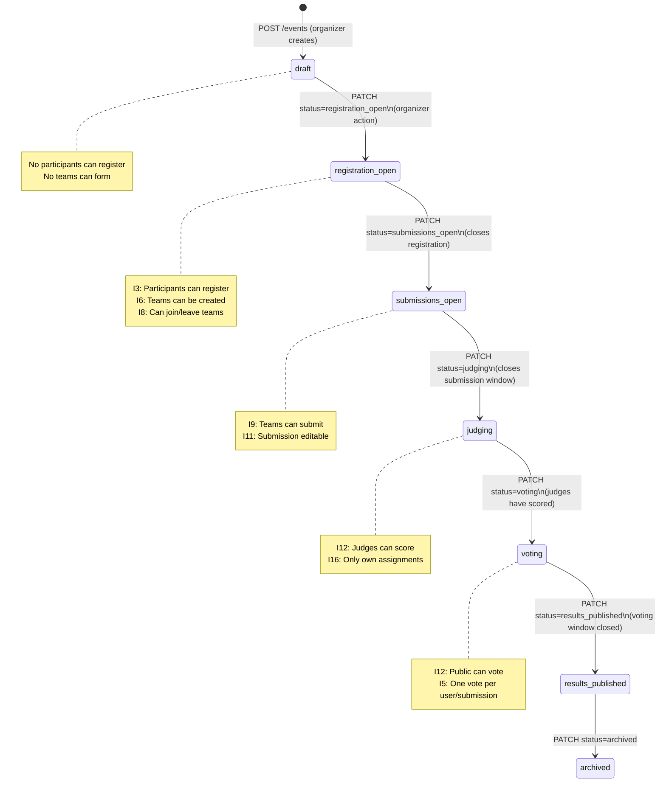
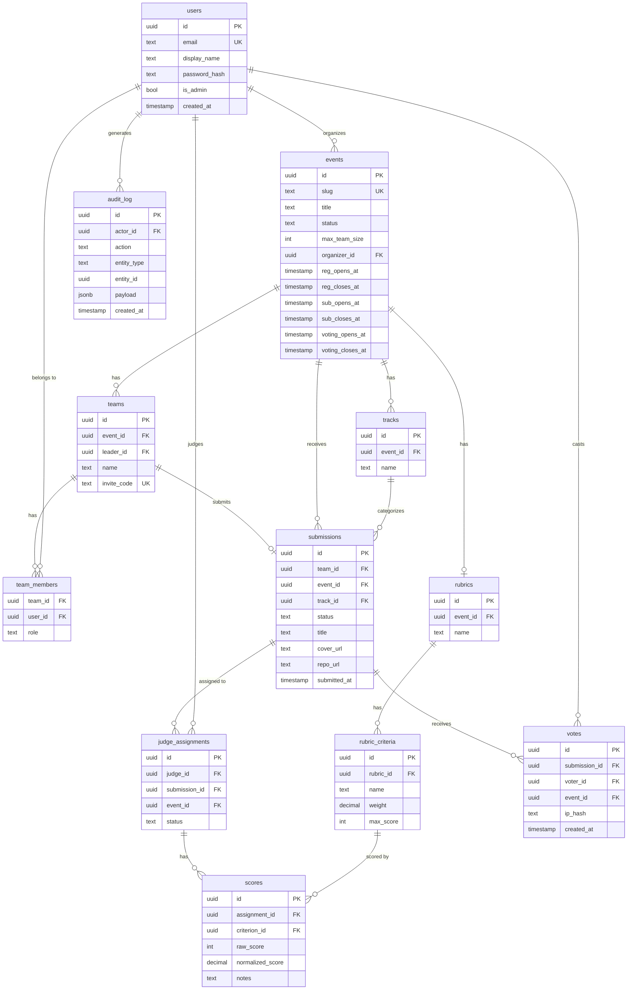
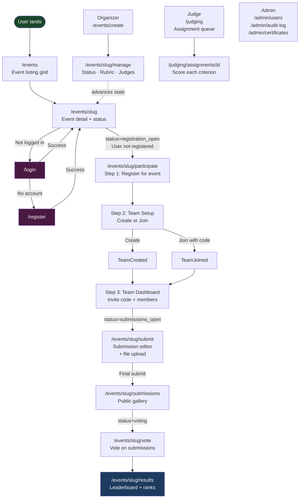
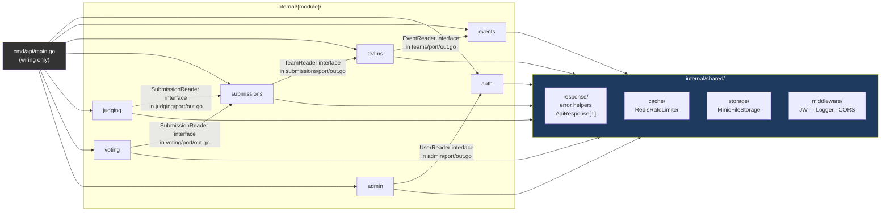
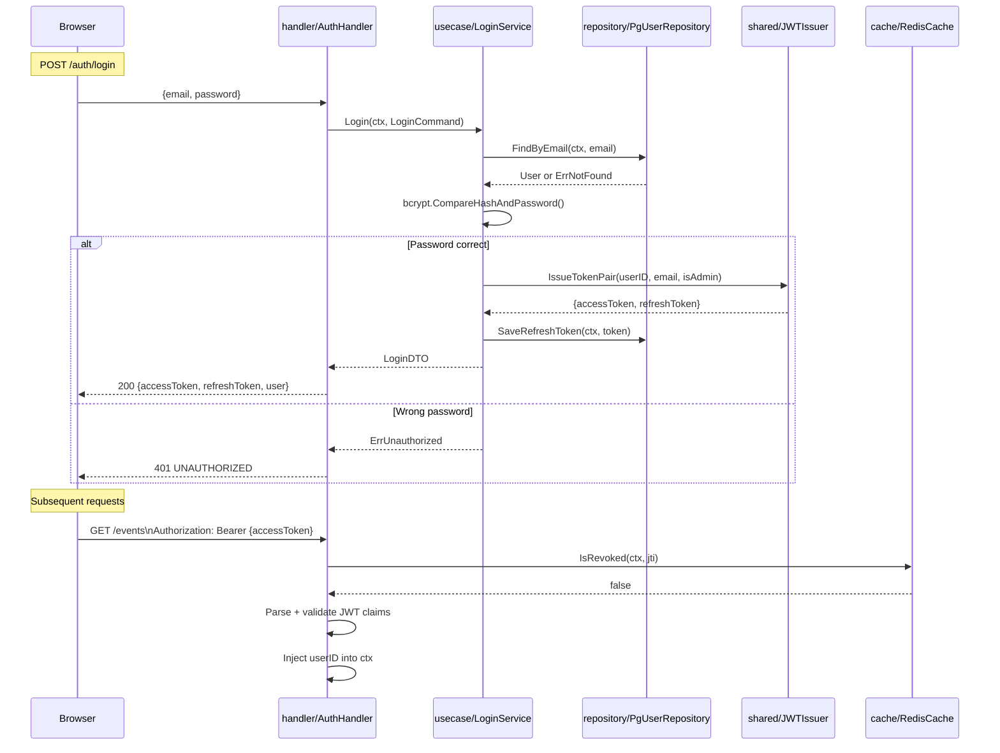
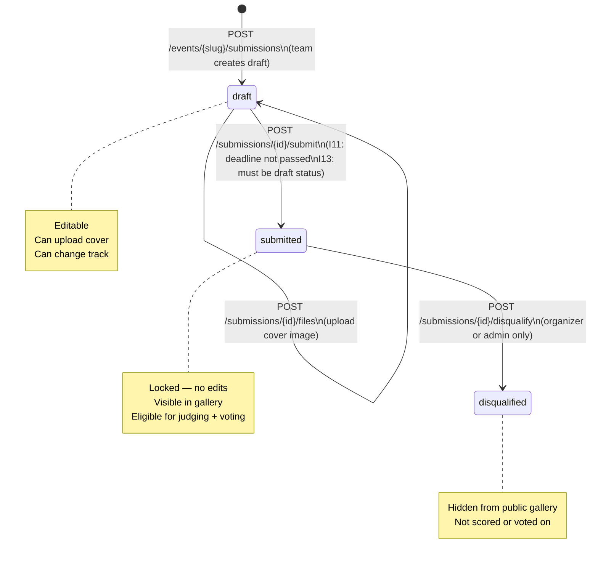

# Architecture & Flow Diagrams — Dogfood Hackathon Platform

> All diagrams use Mermaid syntax. Render in VS Code (Mermaid Preview extension), GitHub, or any Mermaid-compatible viewer.

---

## 1. System Architecture Overview

---

## 2. Hexagonal Architecture — Single Module Layout

Every one of the 7 modules follows exactly this structure. Arrows = allowed import direction.

---

## 3. Request Lifecycle — POST /events/{slug}/votes (Cast Vote)

---

## 4. Event State Machine (Invariant I15)

---

## 5. Database Entity Relationships (Core Tables)

---

## 6. Frontend Page Flow (User Journeys)

---

## 7. Cross-Module Dependency Map

Only allowed imports are shown. Any other arrow = architecture violation.

---

## 8. Authentication Flow (JWT)

---

## 9. Submission Lifecycle

