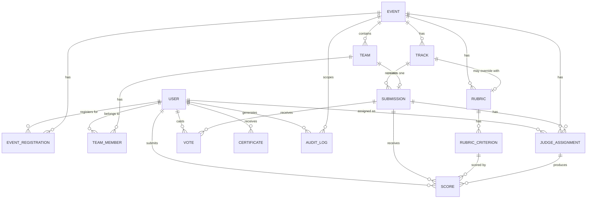

# Domain Objects

> These are the **nouns** of the system. Every API endpoint, DB table, and UI component maps to one or more of these.

---

## Entity Relationship Overview

---

## 1. User

A registered account on the platform. Roles are assigned per event, not globally.

| Field | Type | Notes |
|-------|------|-------|
| `id` | UUID | Primary key |
| `email` | string | Unique, verified |
| `password_hash` | string | Bcrypt |
| `display_name` | string | Public-facing name |
| `avatar_url` | string | Optional |
| `is_verified` | boolean | Email verified flag |
| `is_active` | boolean | Admin can deactivate |
| `is_admin` | boolean | Only global role flag |
| `created_at` | timestamp | |
| `last_login_at` | timestamp | |

---

## 2. Event

A hackathon. The top-level organizational unit everything else belongs to.

| Field | Type | Notes |
|-------|------|-------|
| `id` | UUID | Primary key |
| `slug` | string | URL-friendly unique identifier |
| `title` | string | |
| `description` | text (markdown) | |
| `banner_url` | string | Optional |
| `status` | enum | See Event State Machine |
| `registration_opens_at` | timestamp | |
| `registration_closes_at` | timestamp | |
| `submission_opens_at` | timestamp | |
| `submission_deadline_at` | timestamp | Hard deadline — enforced server-side |
| `judging_opens_at` | timestamp | |
| `judging_deadline_at` | timestamp | Hard deadline — enforced server-side |
| `voting_opens_at` | timestamp | Nullable (T3, optional) |
| `voting_closes_at` | timestamp | Nullable (T3, optional) |
| `results_published_at` | timestamp | Set when organizer publishes |
| `max_team_size` | integer | Default 4 |
| `min_team_size` | integer | Default 1 |
| `judges_per_submission` | integer | Default 3 |
| `voting_weight` | decimal | 0–1, weight of community votes in final score (T3) |
| `is_public` | boolean | Whether gallery is publicly accessible |
| `created_by` | UUID (FK User) | Organizer who created it |
| `created_at` | timestamp | |

---

## 3. EventRegistration

Tracks which participants have registered for an event. Allows un-registration before submission deadline.

| Field | Type | Notes |
|-------|------|-------|
| `id` | UUID | Primary key |
| `event_id` | UUID (FK Event) | |
| `user_id` | UUID (FK User) | |
| `registered_at` | timestamp | |
| `unregistered_at` | timestamp | Nullable — set when participant un-registers |
| `is_active` | boolean | False when un-registered |

**Invariant**: Cannot un-register if user has a `submitted` (non-draft) submission.
**Unique constraint**: `(event_id, user_id)` — one registration record per person per event.

---

## 4. Track

A category within an event. Submissions belong to one track.

| Field | Type | Notes |
|-------|------|-------|
| `id` | UUID | |
| `event_id` | UUID (FK Event) | |
| `name` | string | e.g. "AI Track", "Open Track" |
| `description` | text | |
| `prizes` | jsonb | `[{rank: 1, amount: "₹50000", label: "1st Place"}]` |
| `is_active` | boolean | |
| `sort_order` | integer | Display order |

---

## 5. Team

A group of participants collaborating on one submission. Event-scoped.

| Field | Type | Notes |
|-------|------|-------|
| `id` | UUID | |
| `event_id` | UUID (FK Event) | |
| `name` | string | Team name |
| `invite_code` | string | Unique, random token for joining |
| `created_by` | UUID (FK User) | Always the owner |
| `is_locked` | boolean | True after submission or deadline |
| `created_at` | timestamp | |

---

## 6. TeamMember

Join table between Users and Teams.

| Field | Type | Notes |
|-------|------|-------|
| `id` | UUID | |
| `team_id` | UUID (FK Team) | |
| `user_id` | UUID (FK User) | |
| `role` | enum | `owner` or `member` |
| `joined_at` | timestamp | |
| `invited_by` | UUID (FK User) | Who shared the invite code |

**Unique constraint**: `(team_id, user_id)` and `(event_id, user_id)` via Team join — one team per event per user.

---

## 7. Submission

A project submitted by a team for an event.

| Field | Type | Notes |
|-------|------|-------|
| `id` | UUID | |
| `team_id` | UUID (FK Team) | |
| `event_id` | UUID (FK Event) | Denormalized for query performance |
| `track_id` | UUID (FK Track) | |
| `title` | string | |
| `tagline` | string | One-line description |
| `description` | text (markdown) | Full project description |
| `demo_url` | string | Live demo link |
| `repo_url` | string | Source code link |
| `video_url` | string | Demo video link |
| `cover_image_url` | string | Optional |
| `additional_links` | jsonb | `[{label, url}]` |
| `status` | enum | `draft`, `submitted`, `disqualified` |
| `submitted_at` | timestamp | Set on first `draft → submitted` transition |
| `last_edited_at` | timestamp | |
| `gallery_order` | integer | Randomized at submission time, used for gallery display |

**Unique constraint**: `(team_id, event_id)` — one submission per team per event.

---

## 8. Rubric

A scoring template for an event. Can be per-track or apply to all tracks.

| Field | Type | Notes |
|-------|------|-------|
| `id` | UUID | |
| `event_id` | UUID (FK Event) | |
| `track_id` | UUID (FK Track) | Nullable — null = applies to all tracks |
| `name` | string | e.g. "Standard Rubric" |
| `description` | text | |
| `is_active` | boolean | |

---

## 9. RubricCriterion

One scoring dimension within a rubric.

| Field | Type | Notes |
|-------|------|-------|
| `id` | UUID | |
| `rubric_id` | UUID (FK Rubric) | |
| `name` | string | e.g. "Technical Complexity" |
| `description` | text | Instructions for the judge |
| `max_score` | decimal | e.g. 10 |
| `weight` | decimal | e.g. 0.30 — **all weights for a rubric must sum to 1.0** |
| `sort_order` | integer | |

**Invariant I14**: Sum of `weight` across all criteria in a rubric must equal `1.0`.

---

## 10. JudgeAssignment

Links one judge to one submission for evaluation.

| Field | Type | Notes |
|-------|------|-------|
| `id` | UUID | |
| `event_id` | UUID (FK Event) | Denormalized |
| `submission_id` | UUID (FK Submission) | |
| `judge_id` | UUID (FK User) | Must have `judge` role for this event |
| `assigned_at` | timestamp | |
| `assigned_by` | UUID / `'system'` | User ID or `'system'` for algorithmic |
| `status` | enum | `pending`, `in_progress`, `completed`, `recused` |
| `completed_at` | timestamp | Nullable |

**Invariant I3**: `judge_id` must NOT be a member of the submission's team.

---

## 11. Score

A judge's score on a single criterion for a submission.

| Field | Type | Notes |
|-------|------|-------|
| `id` | UUID | |
| `assignment_id` | UUID (FK JudgeAssignment) | |
| `submission_id` | UUID (FK Submission) | Denormalized |
| `judge_id` | UUID (FK User) | Denormalized |
| `rubric_id` | UUID (FK Rubric) | Denormalized |
| `criterion_id` | UUID (FK RubricCriterion) | |
| `raw_score` | decimal | As entered by judge, 0 to criterion.max_score |
| `normalized_score` | decimal | Nullable — Z-score computed post-judging |
| `comment` | text | Optional per-criterion comment |
| `scored_at` | timestamp | First score entry |
| `updated_at` | timestamp | Last update |

**Unique constraint**: `(assignment_id, criterion_id)` — one score per criterion per assignment.

**Computed aggregates** (done at query time, not stored):
- `weighted_raw_total` = SUM(raw_score × criterion.weight) per (judge, submission)
- `weighted_normalized_total` = SUM(normalized_score × criterion.weight) per (judge, submission)
- `final_score` = AVG(weighted_normalized_total) across all judges for a submission

---

## 12. Vote

A community vote on a submission (T3).

| Field | Type | Notes |
|-------|------|-------|
| `id` | UUID | |
| `submission_id` | UUID (FK Submission) | |
| `voter_id` | UUID (FK User) | |
| `event_id` | UUID (FK Event) | Denormalized |
| `voted_at` | timestamp | |
| `ip_hash` | string | SHA-256 of IP — for Sybil detection, not stored raw |

**Unique constraint**: `(voter_id, submission_id)` — one vote per user per submission (I5).

---

## 13. Certificate (T4)

An auto-generated verifiable record of participation or achievement.

| Field | Type | Notes |
|-------|------|-------|
| `id` | UUID | |
| `user_id` | UUID (FK User) | Recipient |
| `event_id` | UUID (FK Event) | |
| `type` | enum | `participation`, `winner`, `judge` |
| `rank` | integer | Nullable — only for `winner` type |
| `track_id` | UUID (FK Track) | Nullable |
| `issued_at` | timestamp | |
| `verification_hash` | string | HMAC-SHA256 of (id + user_id + event_id + type) |
| `public_url` | string | `/certificates/{id}?verify={hash}` |

---

## 14. AuditLog

Immutable, append-only record of all significant actions. The app DB user has no UPDATE or DELETE privileges on this table.

| Field | Type | Notes |
|-------|------|-------|
| `id` | UUID | |
| `event_id` | UUID | Nullable (platform-level actions have no event) |
| `actor_id` | UUID (FK User) | Who performed the action |
| `action` | enum | See action list below |
| `target_type` | string | e.g. `submission`, `score`, `user` |
| `target_id` | UUID | The affected entity |
| `metadata` | jsonb | Action-specific data (old values, new values, etc.) |
| `ip_address` | string | Requester IP |
| `created_at` | timestamp | |

**Tracked Actions**:
`user.registered`, `user.verified`, `user.impersonated`,
`event.created`, `event.published`, `event.status_changed`,
`team.created`, `team.joined`, `team.left`,
`submission.created`, `submission.submitted`, `submission.disqualified`, `submission.edited`,
`judge.invited`, `judge.assigned`, `judge.recused`,
`score.created`, `score.updated`,
`normalization.triggered`, `normalization.completed`,
`result.published`,
`vote.cast`,
`certificate.issued`
