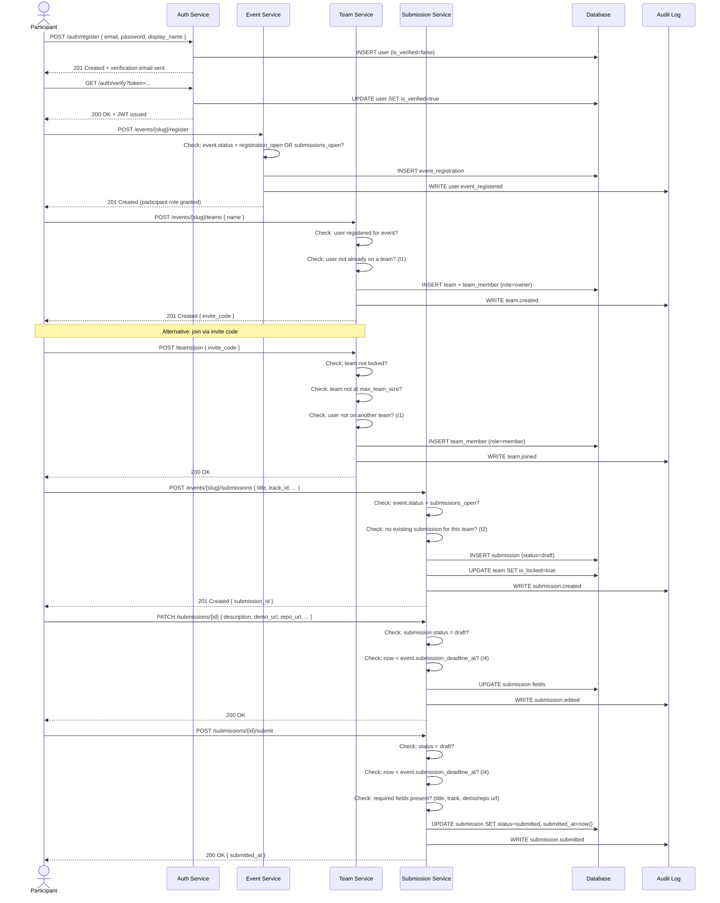
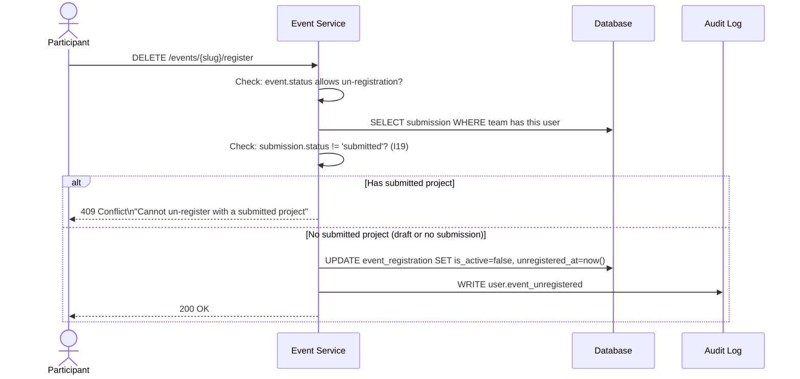

# Flow 1 — Participant Registration & Submission

> Covers the complete journey from account creation through final project submission.
> **Invariants enforced**: I1, I2, I4, I19

---

## Flow Diagram

---

## Un-registration Flow

---

## Error Cases & Responses

| Scenario | HTTP Status | Error Code |
|----------|-------------|------------|
| Email already registered | 409 | `EMAIL_TAKEN` |
| Event not in registration window | 422 | `EVENT_NOT_OPEN` |
| User already on a team (I1) | 409 | `ALREADY_IN_TEAM` |
| Team at max capacity | 422 | `TEAM_FULL` |
| Duplicate submission (I2) | 409 | `SUBMISSION_EXISTS` |
| Edit after deadline (I4) | 403 | `SUBMISSION_LOCKED` |
| Submit after deadline (I4) | 403 | `SUBMISSION_DEADLINE_PASSED` |
| Un-register with submitted project (I19) | 409 | `CANNOT_UNREGISTER_SUBMITTED` |
