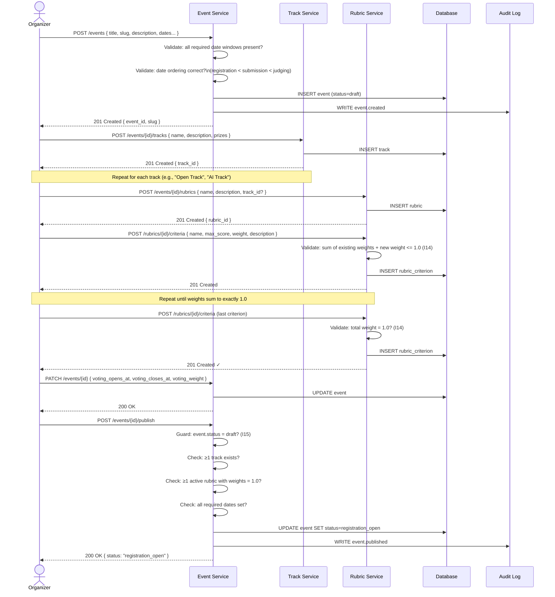
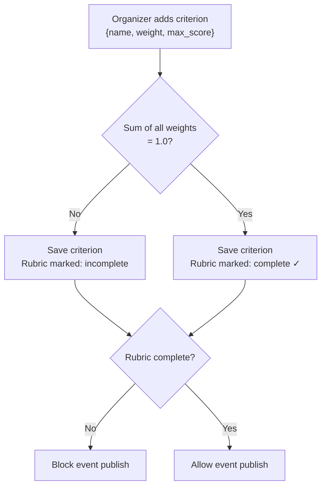

# Flow 2 — Organizer Event Setup

> Covers the complete event configuration lifecycle from creation to publishing.
> **Invariants enforced**: I14, I15

---

## Flow Diagram



---

## Event Date Validation Rules

```mermaid
flowchart LR
    A["registration_opens_at"] -->|must be before| B["registration_closes_at"]
    B -->|must be before| C["submission_opens_at"]
    C -->|must be before| D["submission_deadline_at"]
    D -->|must be before| E["judging_opens_at"]
    E -->|must be before| F["judging_deadline_at"]
    F -->|must be before (if set)| G["voting_opens_at"]
    G -->|must be before| H["voting_closes_at"]
```

---

## Rubric Builder Logic



---

## Error Cases

| Scenario | HTTP Status | Error Code |
|----------|-------------|------------|
| Invalid date ordering | 422 | `INVALID_DATE_ORDER` |
| Weights exceed 1.0 (I14) | 422 | `RUBRIC_WEIGHT_EXCEEDED` |
| Publish with no tracks | 422 | `NO_TRACKS` |
| Publish with incomplete rubric | 422 | `RUBRIC_INCOMPLETE` |
| Invalid state transition (I15) | 409 | `INVALID_STATE_TRANSITION` |
| Slug already taken | 409 | `SLUG_TAKEN` |
