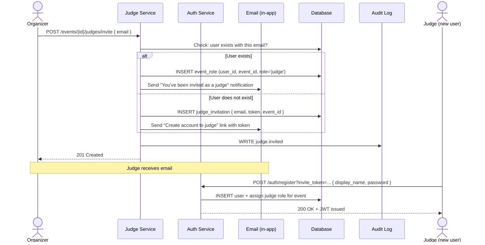
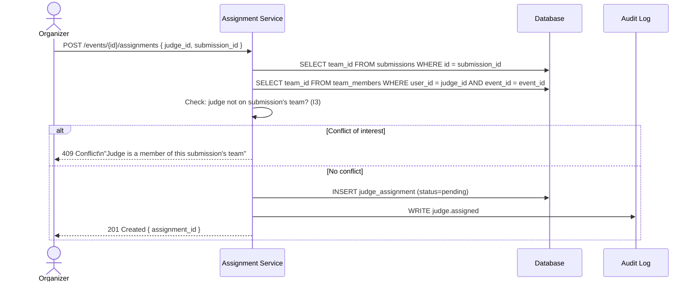
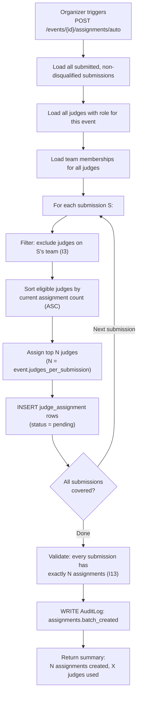

# Flow 3 — Judge Invitation & Assignment

> Covers inviting judges, configuring assignments, and the algorithmic auto-assign process.
> **Invariants enforced**: I3, I13

---

## Flow Diagram — Judge Invitation



---

## Flow Diagram — Manual Judge Assignment



---

## Flow Diagram — Algorithmic Auto-Assignment



---

## Assignment Coverage Validation (I13)

Before the judging window can open, the system validates:

```
For every submission S where status = 'submitted' AND status != 'disqualified':
  count(JudgeAssignment WHERE submission_id = S.id AND status != 'recused') >= 1

If any submission has 0 assignments → block judging window from opening
```

The organizer sees a pre-flight checklist:
```
✅ 47 submissions covered (3 judges each)
✅ 141 total assignments created
✅ 12 judges, avg 11.75 assignments each
⚠️  Judge Alice: 8 assignments (below average — may need more)
```

---

## Error Cases

| Scenario | HTTP Status | Error Code |
|----------|-------------|------------|
| Judge on submission's team (I3) | 409 | `JUDGE_CONFLICT_OF_INTEREST` |
| Judge not invited to event | 403 | `NOT_A_JUDGE` |
| Duplicate assignment | 409 | `ASSIGNMENT_EXISTS` |
| Auto-assign during active judging | 422 | `JUDGING_IN_PROGRESS` |
| Not enough judges to cover all submissions | 422 | `INSUFFICIENT_JUDGES` |
