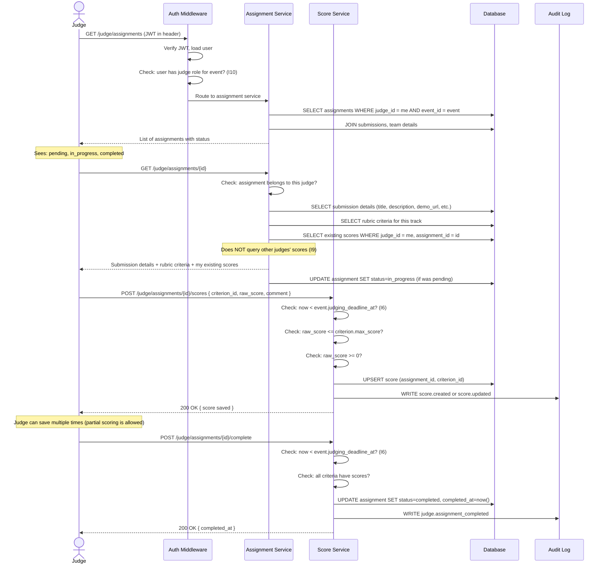
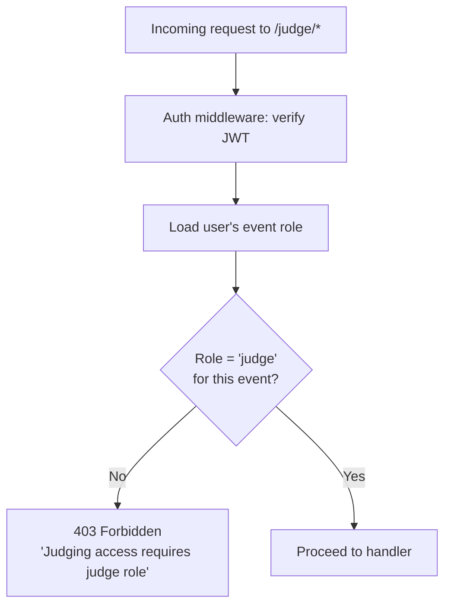

# Flow 4 — Judging

> Covers the judge evaluation workflow from queue view through score submission.
> **Invariants enforced**: I6, I9, I10

---

## Flow Diagram



---

## Judge's Assignment Queue View

```
My Assignments — Dogfood 2026

[●] Project Alpha         — in_progress  (3 of 4 criteria scored)
[○] ByteBuilder           — pending
[○] HackMate              — pending
[✓] Neural Kitchen        — completed
[✓] OpenRuby              — completed
[!] CollabCanvas          — recused

Progress: 2 of 5 active assignments completed
```

---

## Score Entry UI Logic

For each criterion in the rubric, the judge sees:

```
Criterion: Technical Complexity (weight: 30%, max: 10)
Description: Evaluate the depth and quality of the technical implementation...

Score: [  7  ] / 10
Comment (optional): [The architecture is clean but the API lacks input validation...]

[Save]
```

Scoring rules enforced client-side AND server-side (I6):
- `raw_score` must be between `0` and `criterion.max_score`
- `raw_score` must be a number (decimal allowed)
- Scores can be updated until `judging_deadline_at` (I6)
- After deadline: all score inputs are disabled (read-only UI + server rejection)

---

## Score Isolation (I9)

During the judging window, the Score query always includes:

```sql
SELECT s.*
FROM scores s
WHERE s.assignment_id = $assignment_id
  AND s.judge_id = $current_user_id  -- ALWAYS filtered to current judge
```

The submission detail page for a judge:
- Shows the submission content (title, description, demo_url, repo_url, video_url)
- Shows the rubric criteria
- Shows **only the current judge's own scores**
- Does **NOT** show: number of judges assigned, other judges' scores, overall score

---

## Role Isolation (I10)



Note: An organizer who is also invited as a judge has **two separate role records** for the event. The judging endpoint checks for the judge role specifically.

---

## Error Cases

| Scenario | HTTP Status | Error Code |
|----------|-------------|------------|
| No judge role for event (I10) | 403 | `NOT_A_JUDGE` |
| Assignment belongs to different judge | 403 | `ASSIGNMENT_NOT_YOURS` |
| Score after judging deadline (I6) | 403 | `JUDGING_DEADLINE_PASSED` |
| Score out of range | 422 | `SCORE_OUT_OF_RANGE` |
| Complete with missing criteria | 422 | `INCOMPLETE_EVALUATION` |
