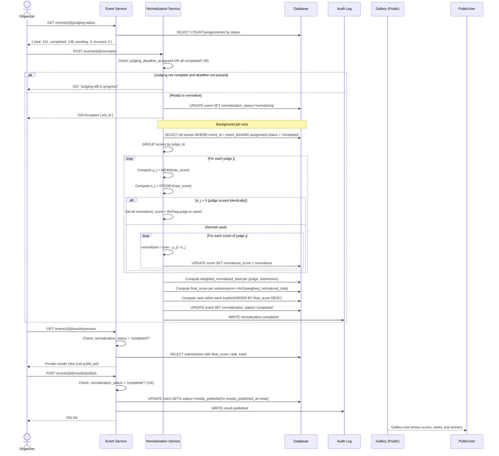

# Flow 5 — Score Normalization & Results Publication

> Covers the full normalization pipeline and results publication.
> **Invariants enforced**: I8, I16

---

## End-to-End Flow Diagram



---

## Normalization Math (Visual)

```
Judge A (Lenient — scores 8, 9, 8.5, 9, 7.5):
  μ_A = 8.4,  σ_A = 0.60
  
  Project X raw=8.0 → normalized = (8.0 - 8.4) / 0.60 = -0.67
  Project Y raw=9.0 → normalized = (9.0 - 8.4) / 0.60 = +1.00

Judge B (Harsh — scores 5, 6, 4.5, 5.5, 7):
  μ_B = 5.6,  σ_B = 0.87
  
  Project X raw=6.0 → normalized = (6.0 - 5.6) / 0.87 = +0.46
  Project Y raw=4.5 → normalized = (4.5 - 5.6) / 0.87 = -1.26

Result: Projects are now comparable across judges.
A lenient judge giving 8 and a harsh judge giving 6 
can be properly weighted together.
```

---

## Results Data Shape

After normalization and publication, each submission has:

```json
{
  "submission_id": "...",
  "title": "Project Alpha",
  "team": "Team Rocket",
  "track": "AI Track",
  "rank": 1,
  "final_score": 0.847,
  "judge_count": 3,
  "criteria_breakdown": [
    { "criterion": "Technical Complexity", "avg_normalized": 1.2, "weight": 0.30 },
    { "criterion": "Innovation",           "avg_normalized": 0.8, "weight": 0.25 },
    { "criterion": "Presentation",         "avg_normalized": 0.6, "weight": 0.20 },
    { "criterion": "Completeness",         "avg_normalized": 0.5, "weight": 0.25 }
  ]
}
```

---

## CSV Export Formats

Organizer can export at any stage:

**Scores export** (`/events/{id}/export/scores.csv`):
```
submission_id,submission_title,judge_id,judge_name,criterion,raw_score,normalized_score,comment
```

**Rankings export** (`/events/{id}/export/rankings.csv`):
```
rank,track,submission_id,title,team_name,final_score,judge_count
```

---

## Error Cases

| Scenario | HTTP Status | Error Code |
|----------|-------------|------------|
| Normalization before judging complete (I8) | 422 | `JUDGING_NOT_COMPLETE` |
| Publish before normalization (I16) | 422 | `NORMALIZATION_NOT_COMPLETE` |
| Normalization already in progress | 409 | `NORMALIZATION_IN_PROGRESS` |
