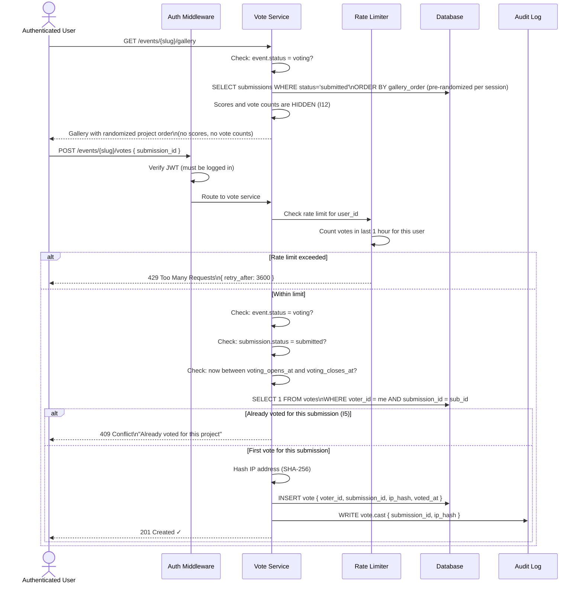
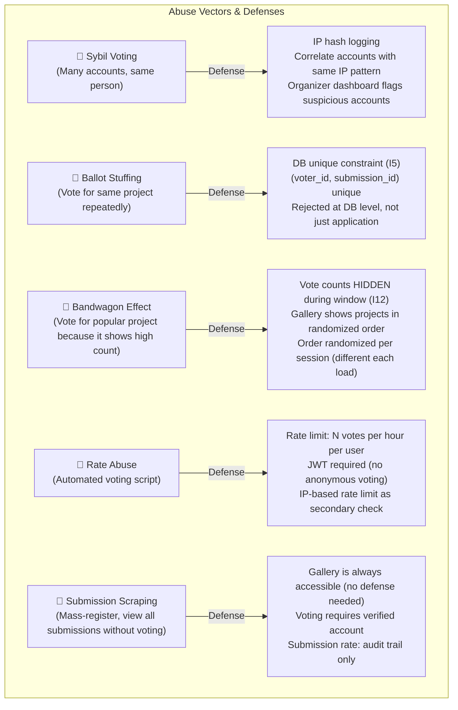

# Flow 6 — Community Voting (T3)

> Covers the public voting system with anti-abuse measures.
> **Invariants enforced**: I5, I12
> **Threat surface**: Sybil voting, ballot stuffing, bandwagon effect, rate abuse

---

## Flow Diagram



---

## Anti-Abuse Mechanisms



---

## Gallery Randomization Strategy

To prevent the bandwagon effect where projects at the top get more votes:

```
On each gallery request:
  1. Submissions are pre-assigned a stable `gallery_order` (random integer) at submission time
  2. Gallery is always sorted by `gallery_order` (consistent within a session)
  3. A "re-shuffle" option allows users to see a different random order
  
Why stable gallery_order?
  - Prevents infinite re-shuffling abuse
  - Still randomizes compared to submission order
  - Consistent experience per load (no flicker)
```

---

## Vote Count Visibility Rules (I12)

| Event Status | Voter sees own vote? | Vote counts visible? | Final results visible? |
|-------------|---------------------|---------------------|----------------------|
| `submissions_open` | ❌ | ❌ | ❌ |
| `judging` | ❌ | ❌ | ❌ |
| `voting` | ✅ (own vote only) | ❌ | ❌ |
| `results_published` | ✅ | ✅ | ✅ |

---

## Rate Limiting Configuration

```
Per-user vote rate limit:
  Window: 1 hour
  Max votes: configurable per event (default: 10 per hour)
  Strategy: sliding window (not fixed window)

Per-IP secondary limit:
  Window: 1 hour  
  Max votes: 3× the per-user limit
  Purpose: Catch coordinated voting from same network
```

---

## Audit Trail for Voting

Every vote is logged to AuditLog with:
```json
{
  "action": "vote.cast",
  "actor_id": "user-uuid",
  "target_type": "submission",
  "target_id": "submission-uuid",
  "metadata": {
    "ip_hash": "sha256-of-ip",
    "event_id": "event-uuid"
  }
}
```

Organizer can export `audit_log` filtered by `action = 'vote.cast'` to detect anomalies.

---

## Sybil Detection (Organizer Dashboard)

The organizer sees flagged accounts:
```
⚠️  Suspicious voting patterns detected:

IP Hash abc123:
  - 14 accounts voted from this IP hash
  - All created within 2 hours
  - All voted for submission "Project X" only

Recommended action: [Review] [Disqualify Votes] [Ignore]
```

---

## Error Cases

| Scenario | HTTP Status | Error Code |
|----------|-------------|------------|
| Not authenticated | 401 | `UNAUTHORIZED` |
| Voting window not open | 422 | `VOTING_NOT_OPEN` |
| Already voted (I5) | 409 | `ALREADY_VOTED` |
| Rate limit exceeded | 429 | `RATE_LIMIT_EXCEEDED` |
| Submission disqualified | 422 | `SUBMISSION_NOT_ELIGIBLE` |
