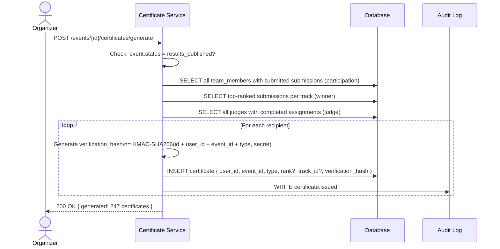
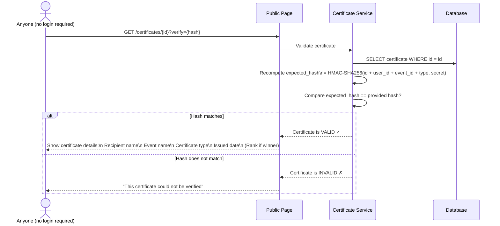

# Flow 7 — Certificates (T4)

> Auto-generated, publicly verifiable records of participation and achievement.
> Certificates are issued after results are published.

---

## Flow Diagram



---

## Certificate Verification Flow



---

## Certificate Types

### Participation Certificate
Issued to every member of a team with a `submitted` submission.

```
┌─────────────────────────────────────────┐
│         CERTIFICATE OF PARTICIPATION    │
│                                         │
│  This certifies that                    │
│                                         │
│         Sujay Nimmagadda                │
│                                         │
│  participated in                        │
│         Dogfood 2026                    │
│  Hackathon by Hackathon Raptors         │
│                                         │
│  Project: HackPlatform                  │
│  Date: September 28, 2026              │
│                                         │
│  Verify: dogfoodhack.com/certs/{id}    │
└─────────────────────────────────────────┘
```

### Winner Certificate
Issued to every member of a winning team, with rank.

```
┌─────────────────────────────────────────┐
│           CERTIFICATE OF ACHIEVEMENT    │
│                                         │
│  🏆  1st Place — AI Track              │
│                                         │
│  Awarded to  Sujay Nimmagadda           │
│  Team:       Team Alpha                 │
│  Project:    HackPlatform               │
│  Event:      Dogfood 2026               │
│                                         │
│  Verify: dogfoodhack.com/certs/{id}    │
└─────────────────────────────────────────┘
```

### Judge Certificate
Issued to every judge who completed at least one assignment.

```
┌─────────────────────────────────────────┐
│       CERTIFICATE OF JUDGE SERVICE      │
│                                         │
│  This certifies that                    │
│         Alice Chen                      │
│  served as a judge for                  │
│         Dogfood 2026                    │
│                                         │
│  Evaluated 15 projects                  │
│  Date: September 28–October 5, 2026    │
│                                         │
│  Verify: dogfoodhack.com/certs/{id}    │
└─────────────────────────────────────────┘
```

---

## Verification Hash Design

```
verification_hash = HMAC-SHA256(
  message = "{id}:{user_id}:{event_id}:{type}:{rank_or_empty}",
  key     = CERTIFICATE_SECRET (env var, never changes after event)
)
```

Properties:
- **Tamper-proof**: Changing any field invalidates the hash
- **No database lookup needed for verification**: hash is self-contained
- **Offline-verifiable**: The algorithm and structure can be published, anyone can re-derive
- **Non-transferable**: Hash is tied to the specific user_id

---

## Public Certificate Page

The public URL `/certificates/{id}` is:
- Accessible without login
- Shows: recipient name, event name, type, date, rank (if winner)
- Shows: ✅ VERIFIED or ❌ INVALID based on hash check
- Designed to be embeddable in LinkedIn / portfolios
- Returns proper Open Graph meta tags for social sharing

---

## Error Cases

| Scenario | HTTP Status | Error Code |
|----------|-------------|------------|
| Generate before results published | 422 | `RESULTS_NOT_PUBLISHED` |
| Certificate ID not found | 404 | `CERTIFICATE_NOT_FOUND` |
| Hash mismatch | 200 (but invalid flag) | Shows ❌ INVALID on page |
