# Hard Invariants

> These are business rules that **must NEVER be violated**.
> Enforcement is at the **database or application service layer** — not just the UI.
> A user bypassing the UI (e.g., direct API call) must still be stopped.

---

## Invariant Map

```mermaid
graph LR
    subgraph "DB Layer (Constraints)"
        I1["I1: One team per user per event"]
        I2["I2: One submission per team per event"]
        I5["I5: One vote per user per submission"]
        I7["I7: AuditLog append-only"]
        I14["I14: Rubric weights sum to 1.0"]
    end

    subgraph "Application Service Layer"
        I3["I3: Judge ≠ own team's submission"]
        I4["I4: Submissions locked after deadline"]
        I6["I6: Scores locked after judging deadline"]
        I8["I8: Normalize only after judging complete"]
        I9["I9: Judges can't see each other's scores"]
        I10["I10: Organizer can't score projects"]
        I11["I11: Disqualified excluded from gallery"]
        I12["I12: Vote counts hidden during window"]
        I13["I13: All submissions must be assigned"]
        I15["I15: Event state machine guards"]
        I16["I16: Publish only after normalization"]
        I17["I17: Participants blocked from judge routes"]
        I18["I18: Admin impersonation always logged"]
        I19["I19: Can't un-register with submitted project"]
    end
```



---

## Full Invariant Table

| ID | Invariant | Enforcement Layer | How |
|----|-----------|-------------------|-----|
| **I1** | A user can be on **at most one team per event** | DB | Unique constraint on `(user_id, event_id)` via `team_members` join |
| **I2** | A team can have **at most one submission per event** | DB | Unique constraint on `(team_id, event_id)` in `submissions` |
| **I3** | A judge **cannot be assigned to their own team's submission** | Service | Assignment service checks team membership before creating `JudgeAssignment` |
| **I4** | Submissions **cannot be edited after `submission_deadline_at`** | Service | Update handler checks `event.submission_deadline_at < now()` before allowing write |
| **I5** | A user **cannot vote more than once per submission** | DB | Unique constraint on `(voter_id, submission_id)` in `votes` |
| **I6** | Scores **cannot be updated after `judging_deadline_at`** | Service | Score update handler checks `event.judging_deadline_at < now()` |
| **I7** | `AuditLog` rows are **append-only** | DB | App DB user has no `UPDATE` or `DELETE` privileges on `audit_log` table |
| **I8** | Normalization can only be triggered **after judging deadline or all assignments completed** | Service | State check before normalization job runs |
| **I9** | A judge **cannot see other judges' scores** while the judging window is open | Service | Score queries always filter `WHERE judge_id = current_user_id` during open window |
| **I10** | An **organizer cannot score projects** via the judge endpoint | Service + Role | Role guard rejects requests to `/judge/*` if user has only `organizer` role |
| **I11** | **Disqualified submissions** are excluded from gallery and rankings | Service | All submission queries include `WHERE status != 'disqualified'` in public contexts |
| **I12** | **Vote counts are hidden** until the voting window closes | Service | Vote count queries check `event.voting_closes_at > now()` before returning totals |
| **I13** | **Every submitted, non-disqualified submission must be assigned** at least 1 judge before judging window opens | Service | Validation check run before `judging_opens_at` transition is allowed |
| **I14** | **Rubric criterion weights must sum to 1.0** for a given rubric | Service + DB | Validated on create/update of rubric criteria; DB check constraint |
| **I15** | **Event state machine transitions** must follow the allowed graph | Service | State machine guard in event update handler — e.g., cannot go from `draft` to `judging` |
| **I16** | **Results can only be published after normalization is complete** | Service | Publish action checks `event.normalization_status = 'completed'` |
| **I17** | **Participants cannot access judging endpoints** | Middleware | Role middleware rejects `participant`-only users from `/api/judge/*` routes |
| **I18** | **Admin impersonation is always logged to AuditLog** | Middleware | Impersonation middleware writes `user.impersonated` before proxying the request |
| **I19** | A participant **cannot un-register from an event** if they have a `submitted` (non-draft) submission | Service | Un-register handler checks submission status before allowing un-registration |

---

## Enforcement Layers Explained

### DB Layer
Applied as PostgreSQL constraints. Cannot be bypassed even with direct DB writes from the application.

```sql
-- I1: one team per user per event
ALTER TABLE team_members ADD CONSTRAINT uq_team_member_event
  UNIQUE (user_id, event_id);  -- enforced via teams join or denormalized column

-- I2: one submission per team per event
ALTER TABLE submissions ADD CONSTRAINT uq_submission_team_event
  UNIQUE (team_id, event_id);

-- I5: one vote per user per submission
ALTER TABLE votes ADD CONSTRAINT uq_vote_user_submission
  UNIQUE (voter_id, submission_id);

-- I7: AuditLog append-only (via DB role permissions)
REVOKE UPDATE, DELETE ON audit_log FROM app_user;

-- I14: Rubric weights (enforced via trigger or application)
-- weights must sum to 1.0 per rubric_id
```

### Application Service Layer
Applied in API handlers and service functions. All protected routes check role and state before executing.

```
Every handler follows this pattern:
  1. Authenticate (JWT valid, user exists, is_active)
  2. Authorize (role check for this event)
  3. Validate state (deadline, status, etc.)
  4. Execute business logic
  5. Write AuditLog entry
  6. Return response
```

### Middleware Layer
Applied globally before any route handler runs.

```
Auth middleware  → verifies JWT, loads user + event role
Role middleware  → enforces coarse-grained role access per route group
Audit middleware → writes audit log for state-changing requests
Rate limit middleware → enforces per-user and per-IP limits
```
