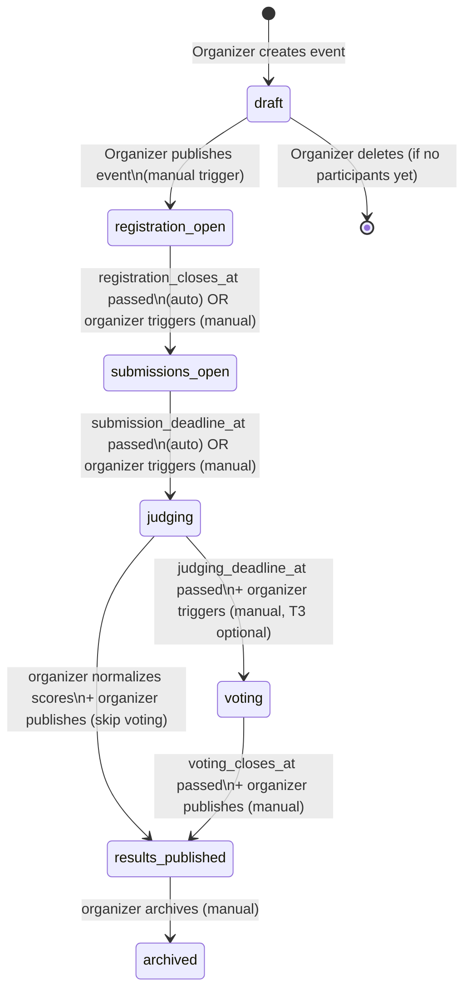

# State Machine: Event Lifecycle

> The `status` field on an `Event` drives access control, UI visibility, and feature availability.
> Transitions are **time-based** (evaluated on each request) or **manually triggered** by the organizer.

---

## State Diagram

---

## Transition Rules

| From | To | Trigger | Guard |
|------|----|---------|-------|
| `draft` | `registration_open` | Organizer publishes | Event must have ≥1 track, ≥1 rubric, all required dates set |
| `registration_open` | `submissions_open` | Time-based or manual | `registration_closes_at` must be in the past |
| `submissions_open` | `judging` | Time-based or manual | `submission_deadline_at` must be in the past |
| `judging` | `voting` | Manual (organizer) | All submissions must have ≥1 judge assigned (I13) |
| `judging` | `results_published` | Manual (organizer) | Normalization must be complete (I16) |
| `voting` | `results_published` | Manual (organizer) | `voting_closes_at` must be past + normalization complete |
| `results_published` | `archived` | Manual (organizer) | No guard |

**Forbidden transitions** (any other transition is rejected by the state machine guard — I15):
- `draft` → `judging` (skipping registration and submissions)
- `results_published` → `judging` (no going backwards)
- Any `→ draft` transition (cannot un-publish)

---

## Feature Access by Event Status

| Feature | `draft` | `registration_open` | `submissions_open` | `judging` | `voting` | `results_published` |
|---------|---------|--------------------|--------------------|-----------|----------|---------------------|
| Participant can register | ❌ | ✅ | ✅ | ❌ | ❌ | ❌ |
| Participant can un-register | ❌ | ✅ | ✅* | ❌ | ❌ | ❌ |
| Team can be created | ❌ | ✅ | ✅ | ❌ | ❌ | ❌ |
| Submission can be created | ❌ | ❌ | ✅ | ❌ | ❌ | ❌ |
| Submission can be edited | ❌ | ❌ | ✅ | ❌ | ❌ | ❌ |
| Judge can score | ❌ | ❌ | ❌ | ✅ | ❌ | ❌ |
| Community voting active | ❌ | ❌ | ❌ | ❌ | ✅ | ❌ |
| Gallery visible | ❌ | ✅** | ✅** | ✅** | ✅** | ✅ |
| Scores visible | ❌ | ❌ | ❌ | ❌ | ❌ | ✅ |

*Un-register blocked if user has a `submitted` (non-draft) submission (I19)
**Gallery shows submissions but without scores
