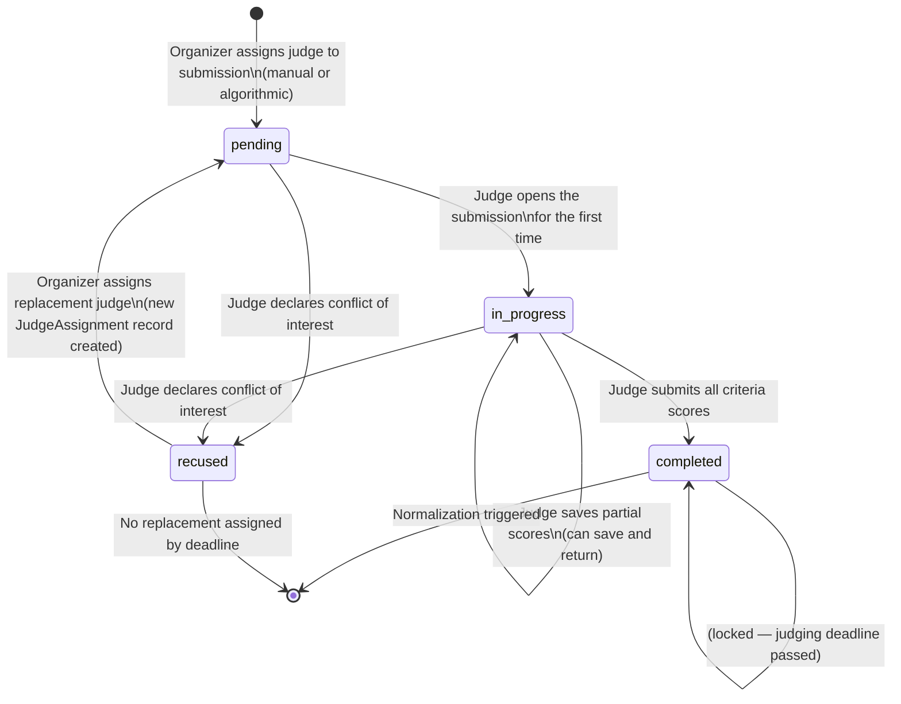
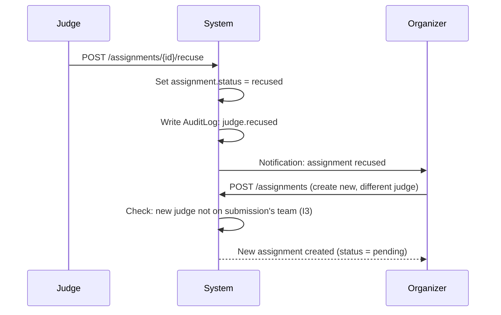

# State Machine: Judge Assignment Lifecycle

> A `JudgeAssignment` tracks the relationship between one judge and one submission.
> Progress through this state machine drives the organizer's progress dashboard.

---

## State Diagram



---

## Transition Rules

| From | To | Who | Guard |
|------|----|-----|-------|
| _(none)_ | `pending` | Organizer or System | Judge has `judge` role for this event; judge is not on submission's team (I3) |
| `pending` | `in_progress` | Judge | Judging window is open; assignment belongs to this judge |
| `pending` | `recused` | Judge | Judge declares conflict; logged to AuditLog |
| `in_progress` | `in_progress` | Judge | Partial score save; judging deadline not passed (I6) |
| `in_progress` | `completed` | Judge | All criteria scored; judging deadline not passed |
| `in_progress` | `recused` | Judge | Judge declares conflict |
| `recused` | `pending` | Organizer | Creates a new `JudgeAssignment` for replacement |

---

## Progress Dashboard Logic

The organizer's progress dashboard shows:

```
Total assignments:  N
Completed:          X   (status = 'completed')
In progress:        Y   (status = 'in_progress')
Pending:            Z   (status = 'pending')
Recused:            R   (status = 'recused')

Per-submission:
  Submission A: 2 of 3 judges completed
  Submission B: 1 of 3 judges completed
  Submission C: 3 of 3 judges completed ✓

Per-judge:
  Judge Alice: 12 of 15 assignments completed
  Judge Bob:   8 of 15 assignments completed
```

---

## Algorithmic Assignment Strategy

When the organizer triggers "Auto-Assign", the system runs:

```
Input:
  - List of submitted, non-disqualified submissions
  - List of judges (with event role)
  - judges_per_submission (from event config, default 3)
  - Judge team memberships (for conflict exclusion)

Algorithm (Round-Robin with Conflict Avoidance):
  1. For each submission S:
     a. Filter judges: exclude any judge on S's team
     b. Sort eligible judges by current assignment count (ascending)
     c. Assign top N judges (N = judges_per_submission)
     d. Create JudgeAssignment records (status = pending)
     e. Increment assignment count for assigned judges

Constraints enforced:
  - No judge assigned to their own team's submission (I3)
  - Balanced distribution (minimize max deviation in assignment counts)
  - Every submission gets exactly N judges (I13)
```

---

## Conflict of Interest Flow


