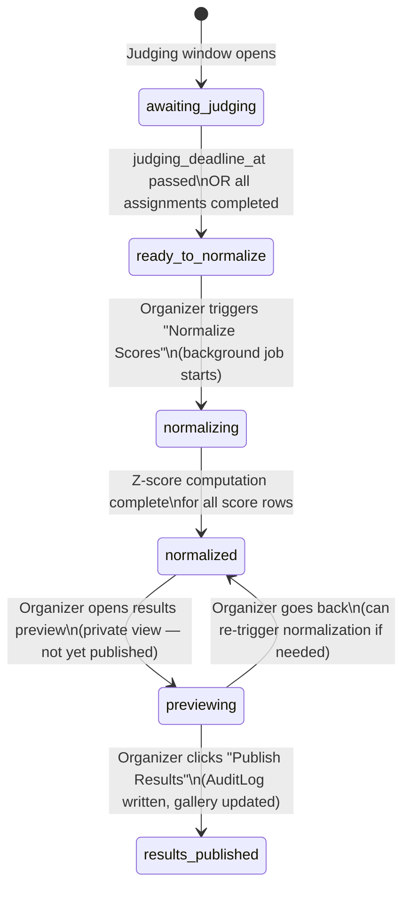
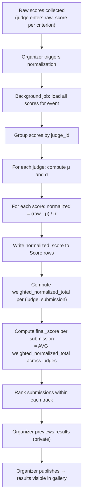

# State Machine: Score Normalization Lifecycle

> Normalization is an **event-level operation** that corrects for judge harshness/leniency bias.
> It is irreversible once published. Raw scores are always preserved alongside normalized scores.

---

## State Diagram



---

## Normalization Algorithm (Z-Score Per Judge)

The goal is to remove each judge's personal scoring bias (some score harshly, some leniently) before comparing scores across judges.

### Formula

For each judge `j`, across all their scored criteria:

```
μ_j  = mean of ALL raw_score values submitted by judge j
σ_j  = standard deviation of ALL raw_score values submitted by judge j

For each Score row where judge_id = j:
  normalized_score = (raw_score - μ_j) / σ_j
```

### Edge Cases

| Case | Handling |
|------|----------|
| Judge has only 1 submission | `σ_j = 0` → cannot normalize. Set `normalized_score = 0` (mean). Flag in report. |
| Judge scores all criteria identically | Same as above — `σ_j = 0`. Flag as low-quality judge data. |
| Missing score for a criterion | Assignment must be `completed` for normalization to include it. Recused assignments are excluded. |

### Aggregation to Final Score

After normalization, for each submission `S`:

```
For each judge j assigned to S:
  weighted_normalized_j = SUM(normalized_score_ij × criterion_i.weight)
    for all criteria i

final_score_S = AVERAGE(weighted_normalized_j)
  across all judges j with status = 'completed'
```

Rankings within each track are ordered by `final_score_S` descending.

---

## Data Flow



---

## Normalization Proof (Bonus +5)

To claim the normalization proof bonus, the platform must:

1. Load the provided fixture data with known raw scores
2. Run normalization
3. Output a report showing:
   - Per-judge: `μ_j`, `σ_j`, raw score range
   - Per-submission: `raw_weighted_total` vs `normalized_weighted_total`
   - A demonstration that a harsh judge's submissions moved up relatively, and a lenient judge's moved down
4. Include this report as `acceptance-report.txt` in the repo

---

## Invariants

- **I8**: Normalization can only be triggered after `judging_deadline_at` has passed OR all `JudgeAssignment` rows are `completed`.
- **I16**: Results can only be published after `normalization_status = 'completed'` on the event.
- Raw scores are **never overwritten** — `normalized_score` is a separate nullable column.
- Normalization can be **re-triggered** before publication (e.g., if a judge's scores are corrected by organizer).
