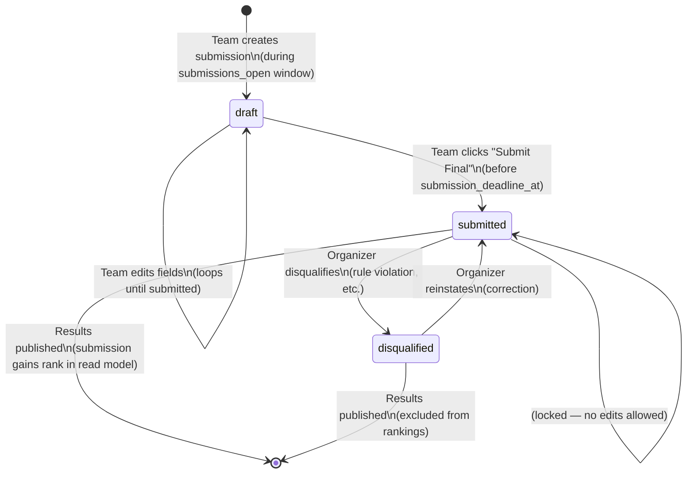

# State Machine: Submission Lifecycle

> A `Submission` is created by a team and moves through states until results are published.
> Status transitions after `submitted` are **organizer-only** or system-triggered.

---

## State Diagram

---

## Transition Rules

| From | To | Who Can Trigger | Guard |
|------|----|-----------------|-------|
| _(none)_ | `draft` | Team member (owner or member) | Event must be in `submissions_open`; team must have no existing submission (I2) |
| `draft` | `draft` | Team member | Event must be in `submissions_open`; before `submission_deadline_at` (I4) |
| `draft` | `submitted` | Team member | Event must be in `submissions_open`; before `submission_deadline_at`; required fields must be complete |
| `submitted` | `disqualified` | Organizer only | Any event status; reason must be provided |
| `disqualified` | `submitted` | Organizer only | Before results published |

---

## Field Editability by Status

| Field | `draft` | `submitted` | `disqualified` |
|-------|---------|-------------|----------------|
| title | ✅ | ❌ | ❌ |
| tagline | ✅ | ❌ | ❌ |
| description | ✅ | ❌ | ❌ |
| demo_url | ✅ | ❌ | ❌ |
| repo_url | ✅ | ❌ | ❌ |
| video_url | ✅ | ❌ | ❌ |
| cover_image_url | ✅ | ❌ | ❌ |
| additional_links | ✅ | ❌ | ❌ |
| track_id | ✅ | ❌ | ❌ |

**All edits are blocked after `submission_deadline_at` regardless of status** (I4).

---

## Visibility Rules

| Context | `draft` | `submitted` | `disqualified` |
|---------|---------|-------------|----------------|
| Team members | ✅ | ✅ | ✅ |
| Public gallery | ❌ | ✅ | ❌ |
| Judges assigned to it | ❌ | ✅ | ❌ |
| Organizer | ✅ | ✅ | ✅ |
| Rankings / Results | ❌ | ✅ | ❌ |
