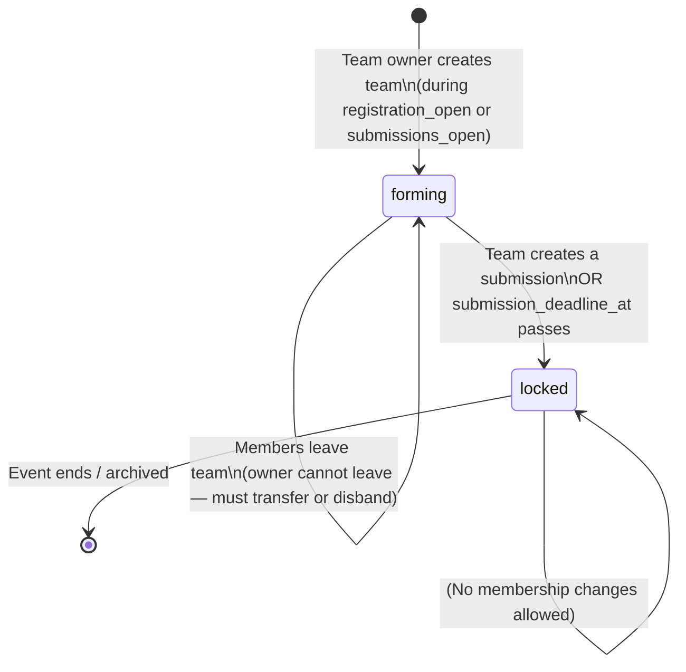
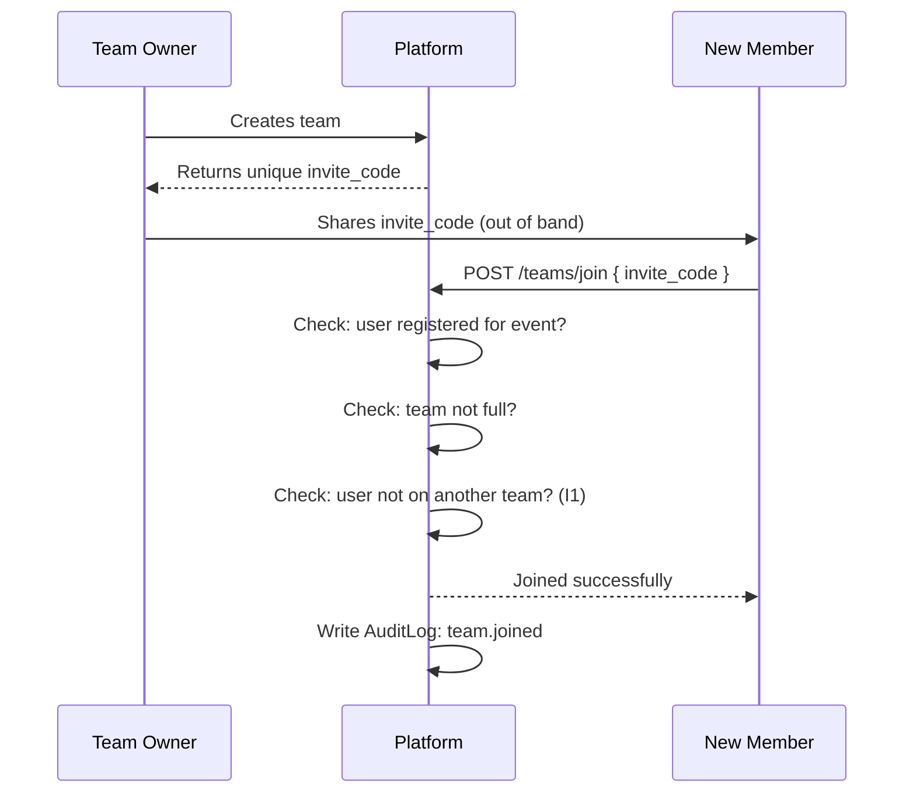

# State Machine: Team Lifecycle

> Teams are **event-scoped**. Once locked, membership cannot change.
> The `is_locked` flag protects submission integrity.

---

## State Diagram

---

## Transition Rules

| From | To | Trigger | Guard |
|------|----|---------|-------|
| _(none)_ | `forming` | Team owner creates team | User registered for event (I1 checked — one team per user per event) |
| `forming` | `forming` (join) | Member uses invite_code | User registered for event; team not at `max_team_size`; user not on another team (I1) |
| `forming` | `forming` (leave) | Member leaves | Member is not the owner; team has no submitted submission |
| `forming` | `locked` | Team creates submission OR deadline passes | Automatic — invite_code deactivated |
| `locked` | — | No further transitions | Membership frozen |

---

## Invite Code Behaviour

---

## Lock Rules

The team locks (`is_locked = true`) when **either** of these happens first:
1. A team member calls "Create Submission" — the act of creating a draft locks the team.
2. `submission_deadline_at` passes — all teams with unsubmitted members are locked automatically.

Once locked:
- Invite code is invalidated
- No one can join
- No one can leave
- Team name can still be changed by owner (cosmetic only, no integrity impact)
